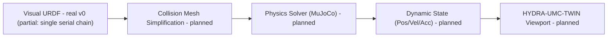

<p align="center">
  
</p>

# 🏗️ HYDRA-UMC-PHYSICS-REPLICA

<p align="center">🇺🇸 <b>English</b> | <a href="README_spa.md">🇪🇸 Español</a> | <a href="README_fra.md">🇫🇷 Français</a> | <a href="README_ita.md">🇮🇹 Italiano</a> | <a href="README_deu.md">🇩🇪 Deutsch</a> | <a href="README_zho.md">🇨🇳 简体中文</a> | <a href="README_jpn.md">🇯🇵 日本語</a></p>

### 📐 High-Fidelity MuJoCo/PhysX Simulation of URDF Kinematic Chains

<p align="left">
  
  
  
  
</p>

---

## 1. 🛠️ TECHNICAL OVERVIEW

**HYDRA-UMC-PHYSICS-REPLICA** is the core physical simulation module of the Digital Twin. It specializes in the low-level calculation of rigid body dynamics, joint constraints, and contact forces for the entire robot catalog.

By integrating state-of-the-art solvers like MuJoCo or NVIDIA PhysX, it provides the mathematical foundation for realistic behavior, including gravity, payload inertia, and surface friction for Pick-and-Place tasks.

### Key Features:
* 📐 **Kinematic Validation (v0):** real forward kinematics and joint-limit checking over a (documented-partial) URDF subset - see "Honesty check" below for exactly what runs today.
* 🔒 **Real v0 - Limit-Aware FK:** `fk-checked` refuses to compute a world-frame pose for a joint position outside its declared URDF limit, backed by a real, reusable joint-limits corpus and regression tests for both boundaries and wildly out-of-range inputs - closing the gap where plain `fk` would silently report a physically-unreachable pose.
* 🏗️ **URDF to Physics (v0, partial):** reads real `<joint>` elements (type/origin/axis/limit) from a URDF file into a chain. *Not yet real:* collision mesh generation - that's still the "physics" half of this feature.
* ⚡ **Real-Time Performance (planned):** parallelized solving for multi-robot workspaces - depends on a real physics-engine integration existing first.
* 🌡️ **Thermal Simulation (planned):** experimental support for emulating heat dissipation in tool heads (T12/Laser).

**Honesty check - what actually runs today:** `fk --urdf PATH --joints "j1=0.5,..."` computes real per-joint world-frame positions by chaining URDF joint transforms, regardless of whether a position is within its declared limit; `fk-checked` runs the same computation but checks every position against `validate-limits`'s real limit check FIRST, refusing to compute (or report) a pose at all if anything is out of range; `validate-limits --urdf PATH --joints "..."` reports real out-of-range joints on its own. All three are pure kinematics - no rigid-body dynamics, no contact forces, no MuJoCo/PhysX solver is wired in yet, and the URDF reader only supports a single serial chain (see `urdf.rs`'s own module docs for why). See [`CHANGELOG.md`](CHANGELOG.md) for exactly what shipped, and the Roadmap below for what's still ahead.

---

## 2. 🔄 PHYSICS PIPELINE

`URDF` (parsing) and a real, standalone kinematics step (`fk`/`validate-limits`,
not shown as its own box below since it replaces `SOLVE`'s role for v0) are
real today. `MESH`, the real `SOLVE` step (an actual MuJoCo/PhysX solver),
`DYN`, and `TWIN` remain future work.



---

## 3. 🧱 ARCHITECTURE & DESIGN DECISIONS

* **Why this simulation has no `hardware/`/`firmware/`/`os/` folders.** Pure software - no board of its own, so those folders were pruned rather than left empty.
* **Why it's a sibling, not a submodule, of HYDRA-UMC-TWIN.** The physics solver runs on its own tick rate, independent from rendering - keeping it a separate process means a slow physics step doesn't stall HYDRA-UMC-TWIN's own frame rate, and either can be swapped/upgraded (e.g. MuJoCo vs PhysX) without touching the other.
* **How this fits the rest of the ecosystem.** Feeds HYDRA-UMC-TWIN's own renderer with real rigid-body/contact simulation - the physical plausibility check behind 'if it works in the Twin, it works on the floor.'
* **Why v0 parses `<joint>` elements in document order instead of walking the real URDF link tree.** A real URDF is a tree of links that can branch at any joint; walking it correctly needs following every joint's `parent`/`child` link names from the root link. v0 instead treats document order as a single serial chain - honest for `HYDRA-UMC-EDITOR-URDF`'s own catalog, which is mostly single serial arms today, but a real limitation for anything that branches (see `urdf.rs`).
* **Why `roxmltree` is the only dependency, not a full physics-engine binding yet.** Real forward kinematics and limit checking need nothing beyond reading XML attributes and doing matrix math by hand (`transform.rs`) - adding a MuJoCo/PhysX FFI binding for that would be dependency weight with no real payoff until actual rigid-body/contact simulation is being built.
* **Why `fk-checked` is a new subcommand instead of changing `fk` in place.** `fk` is the existing low-level pure-math utility - some callers (e.g. tuning a limit itself) genuinely want the unchecked pose for an out-of-range value. `fk-checked` adds the fail-safe, limit-gated entry point real callers should use, without silently changing what `fk` has always meant.
* **Why the joint-limits corpus (`corpus.rs`) is test-only.** It exists purely to give `limits.rs`'s and `kinematics.rs`'s regression tests one shared, real set of fixtures instead of duplicated ad hoc literals - it has no reason to ship in the release binary, so it's gated behind `#[cfg(test)]`.

---

## 📂 DIRECTORY STRUCTURE

Pure software simulation engine, with no hardware design of its own; source
folders are included only when their implementation requires them, so this
project carries no `hardware/`, `firmware/` or `os/` folders.

```text
HYDRA-UMC-PHYSICS-REPLICA/
├── src/
│   ├── transform.rs      # Real Vec3/Mat4 math (translation, axis-angle rotation, rpy)
│   ├── urdf.rs           # Real, partial URDF reader (single serial chain)
│   ├── kinematics.rs     # Real forward_kinematics() + forward_kinematics_checked()
│   ├── limits.rs         # Real validate_limits()
│   ├── corpus.rs         # Test-only reusable joint-limit fixture corpus
│   └── main.rs           # Entry point + real `fk`/`fk-checked`/`validate-limits` subcommands
├── docs/                # Documentation and optimization guides
├── build/               # Build notes/artifacts (cargo's own output lives in target/, gitignored)
├── images/              # Media and diagrams
├── scripts/             # Utility scripts
├── tools/
│   ├── build_test.py    # Non-versioning build/compile check
│   └── ci_validate.py   # Manifest/CHANGELOG/docs validation used by CI
├── Cargo.toml           # Package metadata, dependencies (roxmltree), odometer version
├── bump_version.py      # Odometer-style version bump (used by build.sh/.bat)
├── build.sh / build.bat # Bumps version, `cargo test`, then `cargo build --release`
├── build-test.sh / build-test.bat # Non-versioning build check (no CHANGELOG/version bump)
└── run.sh / run.bat     # Runs the compiled release binary (forwards arguments)
```

---

## 🏗️ BUILD AND RUN GUIDE

Requires the Rust toolchain (`cargo`/`rustc`, install via [rustup](https://rustup.rs)) and Python 3.10+ (only for `bump_version.py`).

```bash
# Linux / macOS
./build.sh   # odometer version bump, `cargo test` (35 tests), then `cargo build --release`
./run.sh     # runs target/release/hydra-umc-physics-replica, prints name + version + role
```

```bat
:: Windows
build.bat
run.bat
```

`build.sh`/`build.bat` bump this project's own `Cargo.toml` version following the ecosystem's "odometer" rule (PATCH+1, carrying into MINOR past 9), run the real test suite, then build a release binary.

The real `fk` and `validate-limits` subcommands need a URDF file:

```bash
./run.sh fk --urdf arm.urdf --joints "shoulder=0,elbow=0"
# shoulder: x=0.000000 y=0.000000 z=0.200000
# elbow: x=0.300000 y=0.000000 z=0.200000

./run.sh validate-limits --urdf arm.urdf --joints "shoulder=3.0,elbow=0.2"
# LIMIT VIOLATION: joint 'shoulder' = 3.000000 (allowed [-1.570000, 1.570000])
```

The real `fk-checked` subcommand refuses to compute a pose at all when a joint is out of range - unlike plain `fk`, which computes it anyway:

```bash
./run.sh fk-checked --urdf arm.urdf --joints "shoulder=0.5,elbow=0.2"
# shoulder: x=0.000000 y=0.000000 z=0.100000
# elbow: x=0.438791 y=0.239713 z=0.100000

./run.sh fk-checked --urdf arm.urdf --joints "shoulder=0.5,elbow=5.0"
# LIMIT VIOLATION: joint 'elbow' = 5.000000 (allowed [-2.000000, 2.000000]) - refusing to compute an unreachable pose

./run.sh fk --urdf arm.urdf --joints "shoulder=0.5,elbow=5.0"
# elbow: x=0.438791 y=0.239713 z=0.100000   <- computed anyway; this is the gap fk-checked closes
```

`fk` exits `0` on success, `2` on a bad `--urdf`/`--joints` value. `fk-checked` exits `0` (real pose), `1` (limit violation), or `2` (bad input). `validate-limits` exits `0` (no violations), `1` (violations found), or `2` (bad input).

---

## 🚀 ROADMAP
* **Phase 1:** Digital Twin synchronization with real-time hardware telemetry and sub-10ms latency.
* **Phase 2:** Physics Replica integration with industrial-grade simulators (Isaac Sim) and deformable body support.
* **Phase 3:** Node Healing automated recovery patterns for decentralized failover and early sensor degradation detection.
* **Phase 4:** Support for deformable body simulation (cables and vacuum tubes) and photorealistic synthetic data generation.

---

## 🔗 Related Projects

This project is part of a larger robotics ecosystem by the same author (JuanenRac / Electro Hobby 3D), spanning firmware, control software, AI nodes, and fleet tooling. Worth knowing about, since a request might actually be about one of these rather than this repository.

### Family

**Parent:** **[HYDRA-UMC-TWIN](https://github.com/JuanenRac/HYDRA-UMC-TWIN)** — the integration parent this simulation feeds.

**Siblings:**
- **[HYDRA-UMC-HIL-BRIDGE](https://github.com/JuanenRac/HYDRA-UMC-HIL-BRIDGE)** — sibling simulation service, same parent.
- **[HYDRA-UMC-SYNTHETIC-DATA-GEN](https://github.com/JuanenRac/HYDRA-UMC-SYNTHETIC-DATA-GEN)** — sibling simulation service, same parent.

### Directly Related (outside the family)

- **[HYDRA-UMC-EDITOR-URDF](https://github.com/JuanenRac/HYDRA-UMC-EDITOR-URDF)** — consumes the URDF models authored here.

### Rest of the Ecosystem

**HYDRA-UMC platform** — the multi-robot micro-factory cell
- **[HYDRA-UMC](https://github.com/JuanenRac/HYDRA-UMC)** — the CM5 + STM32H745 motherboard orchestrating up to 8 robot arms.
- **[HYDRA-UMC-SERVER](https://github.com/JuanenRac/HYDRA-UMC-SERVER)** — the Express/WebSocket backend every control client talks to.
- **[HYDRA-UMC-STUDIO](https://github.com/JuanenRac/HYDRA-UMC-STUDIO)** — web-based control dashboard, multi-robot 3D visualization.
- **[HYDRA-UMC-ANDROID-CONTROL](https://github.com/JuanenRac/HYDRA-UMC-ANDROID-CONTROL)** — Android control app over Wi-Fi/Bluetooth.
- **[HYDRA-UMC-IOS-CONTROL](https://github.com/JuanenRac/HYDRA-UMC-IOS-CONTROL)** — iOS/iPadOS control app built in Flutter.
- **[HYDRA-UMC-SUITE](https://github.com/JuanenRac/HYDRA-UMC-SUITE)** — desktop swarm command center (Python/PySide6).
- **[HYDRA-UMC-EDITOR-URDF](https://github.com/JuanenRac/HYDRA-UMC-EDITOR-URDF)** — desktop URDF model editor for the robot catalog.
- **[HYDRA-UMC-DSI](https://github.com/JuanenRac/HYDRA-UMC-DSI)** — native touch UI for the onboard DSI touchscreen.

**URTC platform** — the tool head controller every HYDRA-UMC robot arm carries
- **[URTC](https://github.com/JuanenRac/URTC)** — CAN bus tool head controller, 25 tool profiles.
- **[URTC-FLASHER](https://github.com/JuanenRac/URTC-FLASHER)** — desktop CAN-OTA + SWD/JTAG flashing tool.
- **[URTC-TESTER](https://github.com/JuanenRac/URTC-TESTER)** — desktop live CAN-bus diagnostic tool.
- **[URTC-WEB-STUDIO](https://github.com/JuanenRac/URTC-WEB-STUDIO)** — browser-based alternative via Web Serial API.

**🎥 Vision AI Node (Hailo-8)**
- [HYDRA-UMC-VISION-NODE](https://github.com/JuanenRac/HYDRA-UMC-VISION-NODE)
- [HYDRA-UMC-VISION-STREAMER](https://github.com/JuanenRac/HYDRA-UMC-VISION-STREAMER)
- [HYDRA-UMC-DETECTION-HEF](https://github.com/JuanenRac/HYDRA-UMC-DETECTION-HEF)
- [HYDRA-UMC-SAFETY-ZONES](https://github.com/JuanenRac/HYDRA-UMC-SAFETY-ZONES)
- [HYDRA-UMC-VISUAL-SERVOING-API](https://github.com/JuanenRac/HYDRA-UMC-VISUAL-SERVOING-API)

**🧠 Cognitive AI Node (Hailo-10)**
- [HYDRA-UMC-COGNITIVE-NODE](https://github.com/JuanenRac/HYDRA-UMC-COGNITIVE-NODE)
- [HYDRA-UMC-VLA-ENGINE](https://github.com/JuanenRac/HYDRA-UMC-VLA-ENGINE)
- [HYDRA-UMC-VOICE-UI](https://github.com/JuanenRac/HYDRA-UMC-VOICE-UI)
- [HYDRA-UMC-SEMANTIC-PLANNER](https://github.com/JuanenRac/HYDRA-UMC-SEMANTIC-PLANNER)
- [HYDRA-UMC-DOCS-QA](https://github.com/JuanenRac/HYDRA-UMC-DOCS-QA)

**🐝 Orchestration & Swarm**
- [HYDRA-UMC-ORCHESTRATOR](https://github.com/JuanenRac/HYDRA-UMC-ORCHESTRATOR)
- [HYDRA-UMC-SWARM-SYNC](https://github.com/JuanenRac/HYDRA-UMC-SWARM-SYNC)
- [HYDRA-UMC-PATH-PLANNER-3D](https://github.com/JuanenRac/HYDRA-UMC-PATH-PLANNER-3D)
- [HYDRA-UMC-JOB-DISPATCHER](https://github.com/JuanenRac/HYDRA-UMC-JOB-DISPATCHER)
- [HYDRA-UMC-NODE-HEALING](https://github.com/JuanenRac/HYDRA-UMC-NODE-HEALING)

**📊 Data & Analytics**
- [HYDRA-UMC-DATALAKE](https://github.com/JuanenRac/HYDRA-UMC-DATALAKE)
- [HYDRA-UMC-TELEMETRY-COLLECTOR](https://github.com/JuanenRac/HYDRA-UMC-TELEMETRY-COLLECTOR)
- [HYDRA-UMC-ANOMALY-DETECTOR](https://github.com/JuanenRac/HYDRA-UMC-ANOMALY-DETECTOR)
- [HYDRA-UMC-PRODUCTION-REPORTS](https://github.com/JuanenRac/HYDRA-UMC-PRODUCTION-REPORTS)

**🏭 Industrial Gateway**
- [HYDRA-UMC-GATEWAY-INDUSTRIAL](https://github.com/JuanenRac/HYDRA-UMC-GATEWAY-INDUSTRIAL)
- [HYDRA-UMC-OPCUA-SERVER](https://github.com/JuanenRac/HYDRA-UMC-OPCUA-SERVER)
- [HYDRA-UMC-MQTT-BROKER](https://github.com/JuanenRac/HYDRA-UMC-MQTT-BROKER)
- [HYDRA-UMC-MTCONNECT-ADAPTER](https://github.com/JuanenRac/HYDRA-UMC-MTCONNECT-ADAPTER)

**🛠️ Complementary Tools**
- [URTC-SMART-RACK](https://github.com/JuanenRac/URTC-SMART-RACK)
- [URTC-VISION-TOOL](https://github.com/JuanenRac/URTC-VISION-TOOL)
- [HYDRA-UMC-WATCH](https://github.com/JuanenRac/HYDRA-UMC-WATCH)
- [HYDRA-UMC-TOOL-CLI](https://github.com/JuanenRac/HYDRA-UMC-TOOL-CLI)
- [HYDRA-UMC-DASHBOARD-AI](https://github.com/JuanenRac/HYDRA-UMC-DASHBOARD-AI)


## 👤 AUTHOR
**JuanenRac** (Electro Hobby 3D)
📧 electrohobby3d@gmail.com

## 📜 LICENSE
GPL-3.0 - See LICENSE for details.
