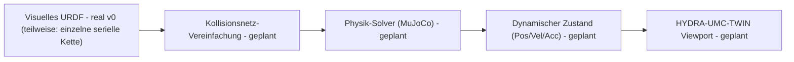

<p align="center">
  
</p>

# 🏗️ HYDRA-UMC-PHYSICS-REPLICA

<p align="center"><a href="README.md">🇺🇸 English</a> | <a href="README_spa.md">🇪🇸 Español</a> | <a href="README_fra.md">🇫🇷 Français</a> | <a href="README_ita.md">🇮🇹 Italiano</a> | 🇩🇪 <b>Deutsch</b> | <a href="README_zho.md">🇨🇳 简体中文</a> | <a href="README_jpn.md">🇯🇵 日本語</a></p>

### 📐 High-Fidelity MuJoCo/PhysX-Simulation von URDF-Kinematikketten

<p align="left">
  
  
  
  
</p>

---

## 1. 🛠️ TECHNISCHER ÜBERBLICK

**HYDRA-UMC-PHYSICS-REPLICA** ist das zentrale physikalische Simulationsmodul des Digital Twin. Es ist spezialisiert auf die Low-Level-Berechnung von Starrkörperdynamik, Gelenkbeschränkungen und Kontaktkräften für den gesamten Roboterkatalog.

Durch die Integration modernster Solver wie MuJoCo oder NVIDIA PhysX bietet es die mathematische Grundlage für realistisches Verhalten, einschließlich Schwerkraft, Nutzlastträgheit und Oberflächenreibung für Pick-and-Place-Aufgaben.

### Hauptmerkmale:
* 📐 **Kinematische Validierung (v0):** echte Vorwärtskinematik und echte Gelenkgrenzenprüfung über eine (dokumentiert-partielle) URDF-Teilmenge - siehe "Ehrlichkeitscheck" unten für das, was heute genau läuft.
* 🔒 **Echtes v0 - Grenzen-bewusste FK:** `fk-checked` verweigert die Berechnung einer Weltraum-Pose für eine Gelenkposition außerhalb ihrer deklarierten URDF-Grenze, gestützt auf einen echten, wiederverwendbaren Gelenkgrenzen-Korpus und Regressionstests für beide Grenzen sowie stark außerhalb liegende Eingaben - schließt die Lücke, in der reines `fk` still eine physikalisch unerreichbare Pose melden würde.
* 🏗️ **URDF zu Physik (v0, teilweise):** liest echte `<joint>`-Elemente (Typ/Ursprung/Achse/Grenze) aus einer URDF-Datei in eine Kette ein. *Noch nicht real:* die Erzeugung von Kollisionsnetzen - das bleibt die "physikalische" Hälfte dieses Features.
* ⚡ **Echtzeit-Performance (geplant):** parallelisierte Berechnung für Multi-Roboter-Arbeitsbereiche - setzt voraus, dass zuerst eine echte Physik-Engine-Integration existiert.
* 🌡️ **Thermische Simulation (geplant):** experimentelle Unterstützung für die Emulation der Wärmeableitung in Werkzeugköpfen (T12/Laser).

**Ehrlichkeitscheck - was heute wirklich läuft:** `fk --urdf PFAD --joints "j1=0.5,..."` berechnet echte Weltraum-Positionen pro Gelenk durch Verketten der URDF-Gelenktransformationen, unabhängig davon, ob eine Position innerhalb ihrer deklarierten Grenze liegt; `fk-checked` führt dieselbe Berechnung durch, prüft aber zuerst jede Position gegen die echte Prüfung von `validate-limits` und verweigert die Berechnung (oder Meldung) jeglicher Pose, falls etwas außerhalb des Bereichs liegt; `validate-limits --urdf PFAD --joints "..."` meldet echte Gelenke außerhalb ihres Bereichs eigenständig. Alle drei sind reine Kinematik - keine Starrkörperdynamik, keine Kontaktkräfte, noch kein MuJoCo/PhysX-Solver angebunden, und der URDF-Reader unterstützt nur eine einzelne serielle Kette (siehe die eigene Dokumentation des `urdf.rs`-Moduls für das Warum). Siehe [`CHANGELOG.md`](CHANGELOG.md) für genau das, was geliefert wurde, und die Roadmap unten für das, was noch aussteht.

---

## 2. 🔄 PHYSIK-PIPELINE

`URDF` (Parsing) und ein echter, eigenständiger Kinematik-Schritt
(`fk`/`validate-limits`, unten nicht als eigene Box dargestellt, da er
für v0 die Rolle von `SOLVE` übernimmt) sind heute real. `MESH`, der
echte `SOLVE`-Schritt (ein echter MuJoCo/PhysX-Solver), `DYN` und `TWIN`
bleiben zukünftige Arbeit.



---

## 3. 🧱 ARCHITEKTUR & DESIGNENTSCHEIDUNGEN

* **Warum diese Simulation keine `hardware/`/`firmware/`/`os/`-Ordner hat.** Reine Software - keine eigene Platine, daher wurden diese Ordner entfernt statt leer gelassen.
* **Warum sie Geschwister, kein Submodul, von HYDRA-UMC-TWIN ist.** Der Physik-Solver läuft mit eigener Tick-Rate, unabhängig vom Rendering - ihn als separaten Prozess zu halten bedeutet, dass ein langsamer Physikschritt nicht die eigene Framerate von HYDRA-UMC-TWIN blockiert, und beide können ausgetauscht/aktualisiert werden (z. B. MuJoCo gegen PhysX), ohne den anderen zu berühren.
* **Wie sich das ins restliche Ökosystem einfügt.** Speist die eigene Rendering-Engine von HYDRA-UMC-TWIN mit echter Starrkörper-/Kontaktsimulation - die Prüfung physikalischer Plausibilität hinter 'wenn es im Zwilling funktioniert, funktioniert es in der Fabrik'.
* **Warum v0 `<joint>`-Elemente in Dokumentreihenfolge parst, statt den echten URDF-Link-Baum zu durchlaufen.** Ein echtes URDF ist ein Baum von Links, der sich an jedem Gelenk verzweigen kann; ihn korrekt zu durchlaufen erfordert, den `parent`/`child`-Linknamen jedes Gelenks ausgehend vom Wurzel-Link zu folgen. v0 behandelt stattdessen die Dokumentreihenfolge als eine einzelne serielle Kette - ehrlich für den eigenen Katalog von `HYDRA-UMC-EDITOR-URDF`, der heute größtenteils aus einzelnen seriellen Armen besteht, aber eine echte Einschränkung für alles, was sich verzweigt (siehe `urdf.rs`).
* **Warum `roxmltree` die einzige Abhängigkeit ist, noch kein vollständiges Physik-Engine-Binding.** Echte Vorwärtskinematik und echte Grenzenprüfung brauchen nichts weiter als das Lesen von XML-Attributen und handgeschriebene Matrixalgebra (`transform.rs`) - ein MuJoCo/PhysX-FFI-Binding dafür hinzuzufügen wäre Abhängigkeitsgewicht ohne echten Nutzen, bis tatsächlich eine echte Starrkörper-/Kontaktsimulation gebaut wird.
* **Warum `fk-checked` ein neuer Subbefehl ist, statt `fk` an Ort und Stelle zu ändern.** `fk` ist das bestehende Low-Level-Dienstprogramm, reine Mathematik - manche Aufrufer (z. B. das Anpassen einer Grenze selbst) wollen tatsächlich die ungeprüfte Pose für einen außerhalb liegenden Wert. `fk-checked` fügt den fehlersicheren, grenzengeprüften Einstiegspunkt hinzu, den echte Aufrufer nutzen sollten, ohne stillschweigend zu ändern, was `fk` schon immer bedeutet hat.
* **Warum der Gelenkgrenzen-Korpus (`corpus.rs`) nur für Tests ist.** Er existiert einzig, um den Regressionstests von `limits.rs` und `kinematics.rs` einen einzigen, echten, gemeinsamen Fixture-Satz zu geben, statt duplizierter Ad-hoc-Literale - er hat keinen Grund, in der Release-Binärdatei enthalten zu sein, daher ist er hinter `#[cfg(test)]` geschützt.

---

## 📂 VERZEICHNISSTRUKTUR

Reine Software-Simulations-Engine ohne eigenes Hardware-Design; Quellordner
werden nur aufgenommen, wenn ihre Implementierung sie erfordert. Daher hat
dieses Projekt keine Ordner `hardware/`, `firmware/` oder `os/`.

```text
HYDRA-UMC-PHYSICS-REPLICA/
├── src/
│   ├── transform.rs      # Echte Vec3/Mat4 (Translation, Achsen-Winkel-Rotation, rpy)
│   ├── urdf.rs           # Echter, partieller URDF-Reader (einzelne serielle Kette)
│   ├── kinematics.rs     # Echtes forward_kinematics() + forward_kinematics_checked()
│   ├── limits.rs         # Echtes validate_limits()
│   ├── corpus.rs         # Fixture-Korpus für Gelenkgrenzen, nur für Tests
│   └── main.rs           # Einstiegspunkt + echte `fk`/`fk-checked`/`validate-limits`-Subbefehle
├── docs/                # Dokumentation und Optimierungsleitfäden
├── build/               # Build-Notizen/Artefakte (die eigentliche cargo-Ausgabe liegt in target/, per .gitignore ausgeschlossen)
├── images/              # Medien und Diagramme
├── tools/
│   ├── build_test.py    # Nicht-versionierender Build-Check
│   └── ci_validate.py   # Manifest/CHANGELOG/Docs-Validierung, von CI genutzt
├── Cargo.toml           # Paket-Metadaten, Abhängigkeiten (roxmltree), Kilometerzähler-Version
├── bump_version.py      # Native Kilometerzähler-artige Versions-Bump (von build.sh/.bat verwendet)
├── bump_manifest_version.py # Synchronisiert die Version von hydra-umc.project.json mit der nativen (--sync)
├── build.sh / build.bat # Erhöht die Version, `cargo test`, dann `cargo build --release`
├── build-test.sh / build-test.bat # Nicht-versionierender Build-Check
└── run.sh / run.bat     # Führt die kompilierte Release-Binärdatei aus (leitet Argumente weiter)
```

---

## 🏗️ BUILD UND RUN

Erfordert die Rust-Toolchain (`cargo`/`rustc`, Installation via [rustup](https://rustup.rs)) und Python 3.10+ (nur für `bump_version.py`).

```bash
# Linux / macOS
./build.sh   # Kilometerzähler-Versions-Bump, `cargo test` (35 Tests), dann `cargo build --release`
./run.sh     # führt target/release/hydra-umc-physics-replica aus, gibt Name + Version + Rolle aus
```

```bat
:: Windows
build.bat
run.bat
```

`build.sh`/`build.bat` erhöhen die Version der eigenen `Cargo.toml` dieses Projekts nach der "Kilometerzähler"-Regel des Ökosystems (PATCH+1, mit Übertrag auf MINOR nach 9), führen die echte Testsuite aus und bauen dann eine Release-Binärdatei.

Die echten Subbefehle `fk` und `validate-limits` benötigen eine URDF-Datei:

```bash
./run.sh fk --urdf arm.urdf --joints "shoulder=0,elbow=0"
# shoulder: x=0.000000 y=0.000000 z=0.200000
# elbow: x=0.300000 y=0.000000 z=0.200000

./run.sh validate-limits --urdf arm.urdf --joints "shoulder=3.0,elbow=0.2"
# LIMIT VIOLATION: joint 'shoulder' = 3.000000 (allowed [-1.570000, 1.570000])
```

Der echte Subbefehl `fk-checked` verweigert die Berechnung einer Pose, wenn ein Gelenk außerhalb des Bereichs liegt - anders als reines `fk`, das sie trotzdem berechnet:

```bash
./run.sh fk-checked --urdf arm.urdf --joints "shoulder=0.5,elbow=0.2"
# shoulder: x=0.000000 y=0.000000 z=0.100000
# elbow: x=0.438791 y=0.239713 z=0.100000

./run.sh fk-checked --urdf arm.urdf --joints "shoulder=0.5,elbow=5.0"
# LIMIT VIOLATION: joint 'elbow' = 5.000000 (allowed [-2.000000, 2.000000]) - refusing to compute an unreachable pose

./run.sh fk --urdf arm.urdf --joints "shoulder=0.5,elbow=5.0"
# elbow: x=0.438791 y=0.239713 z=0.100000   <- wird trotzdem berechnet; das ist die Lücke, die fk-checked schließt
```

`fk` beendet sich mit `0` bei Erfolg, `2` bei ungültigem `--urdf`/`--joints`-Wert. `fk-checked` beendet sich mit `0` (echte Pose), `1` (Grenzverletzung) oder `2` (ungültige Eingabe). `validate-limits` beendet sich mit `0` (keine Verletzungen), `1` (Verletzungen gefunden) oder `2` (ungültige Eingabe).

---

## 🚀 FAHRPLAN
* **Phase 1:** Digital-Twin-Synchronisation mit Echtzeit-Hardware-Telemetrie und Sub-10ms-Latenz.
* **Phase 2:** Physics Replica-Integration mit industriellen Simulatoren (Isaac Sim) und Unterstützung für verformbare Körper.
* **Phase 3:** Automatisierte Wiederherstellungsmuster von Node Healing für dezentrales Failover und frühzeitige Erkennung von Sensordegradation.
* **Phase 4:** Unterstützung für die Simulation deformierbarer Körper (Kabel und Vakuumschläuche) und fotorealistische Erzeugung synthetischer Daten.

---

## 🔗 Verwandte Projekte

Dieses Projekt ist Teil des HYDRA-UMC-Robotik-Ökosystems desselben Autors (JuanenRac / Electro Hobby 3D). Gut zu wissen, da eine Anfrage eigentlich eines dieser Projekte betreffen könnte statt dieses Repositorys.

**Übergeordnetes Projekt**
- **[HYDRA-UMC-TWIN](https://github.com/JuanenRac/HYDRA-UMC-TWIN)** — Integrationsknoten für die Digital-Twin-Engine, mit einem echten Versionskompatibilitäts-Sync-Vertrag; das übergeordnete Projekt, dessen spezifischer Simulationsdienst dieses Repository innerhalb seiner eigenen Digital-Twin-Engine ist.

**Geschwisterprojekte** — die übrigen Simulationsdienste der eigenen Digital-Twin-Engine von HYDRA-UMC-TWIN
- **[HYDRA-UMC-HIL-BRIDGE](https://github.com/JuanenRac/HYDRA-UMC-HIL-BRIDGE)** — echte Hardware-in-the-Loop-Sicherheitsverriegelung, die Befehle zwischen Simulation und echter Hardware routet.
- **[HYDRA-UMC-SYNTHETIC-DATA-GEN](https://github.com/JuanenRac/HYDRA-UMC-SYNTHETIC-DATA-GEN)** — echter prozeduraler 2D-Szenengenerator mit YOLO/COCO-Annotationsexport.

**Direkt verwandt**
- **[HYDRA-UMC-EDITOR-URDF](https://github.com/JuanenRac/HYDRA-UMC-EDITOR-URDF)** — grafischer Desktop-URDF-Ersteller/-Editor, der fertige Modelle in STUDIOs eigenen Katalog überträgt — das Werkzeug, mit dem die URDF-Modelle erstellt werden, die dieses Projekt liest (`fk`/`validate-limits`).

**Ebenfalls Teil des Ökosystems**

*Kern-Hardware & Plattform*
- **[HYDRA-UMC](https://github.com/JuanenRac/HYDRA-UMC)** — das physische Motherboard des Roboterarms: CM5-Host + Dual-Core-STM32H745, koordiniert bis zu 8 Werkzeugarme über CAN-OTA/SPI-OTA.
- **[HYDRA-UMC-OS](https://github.com/JuanenRac/HYDRA-UMC-OS)** — reproduzierbare Raspberry-Pi-OS-Produktschicht für den CM5: schreibgeschützter Agent, validierte Konfiguration/Profile, WiFi-Ersteinrichtung.
- **[HYDRA-UMC-SDK](https://github.com/JuanenRac/HYDRA-UMC-SDK)** — der gemeinsame JSON-Schema-Vertrag und die Sicherheitsschranke, gegen die jede Bridge ihre Befehle validiert.

*Kern-Backend & Clients*
- **[HYDRA-UMC-SERVER](https://github.com/JuanenRac/HYDRA-UMC-SERVER)** — das reale Headless-Backend (REST/WebSocket), mit dem jeder Steuerungsclient tatsächlich spricht.
- **[HYDRA-UMC-STUDIO](https://github.com/JuanenRac/HYDRA-UMC-STUDIO)** — Web-Steuerungs-Dashboard mit Echtzeit-3D-Visualisierung mehrerer Roboter.
- **[HYDRA-UMC-SUITE](https://github.com/JuanenRac/HYDRA-UMC-SUITE)** — Desktop-Schwarmleitstand (PySide6) für mehrere Server gleichzeitig, verpackt als eigenständige ausführbare Datei.
- **[HYDRA-UMC-ANDROID-CONTROL](https://github.com/JuanenRac/HYDRA-UMC-ANDROID-CONTROL)** — native Android-Steuerungs-App mit biometrischem Login und einer gekoppelten Wear-OS-Begleit-App.
- **[HYDRA-UMC-IOS-CONTROL](https://github.com/JuanenRac/HYDRA-UMC-IOS-CONTROL)** — iOS/iPadOS-Steuerungs-App (Flutter) mit Echtzeit-WebSocket-Synchronisierung.
- **[HYDRA-UMC-DSI](https://github.com/JuanenRac/HYDRA-UMC-DSI)** — native Touch-UI für das eingebaute 7"-DSI-Touchscreen, direkt auf dem CM5 eingebettet.
- **[HYDRA-UMC-BRIDGE-AMR](https://github.com/JuanenRac/HYDRA-UMC-BRIDGE-AMR)** — Koordinationsschranke für AGV-/AMR-Flotten über einen echten VDA-5050-MQTT-Publisher.
- **[HYDRA-UMC-BRIDGE-CNC](https://github.com/JuanenRac/HYDRA-UMC-BRIDGE-CNC)** — High-Level-Koordinator für CNC-Zellen mit echtem GRBL-Status-/Steuerbyte-Zugriff.
- **[HYDRA-UMC-BRIDGE-DROIDS](https://github.com/JuanenRac/HYDRA-UMC-BRIDGE-DROIDS)** — Koordinationsschranke für laufende/humanoide Droiden, mit einem echten Boston-Dynamics-Spot-Befehlssender.
- **[HYDRA-UMC-BRIDGE-LASER](https://github.com/JuanenRac/HYDRA-UMC-BRIDGE-LASER)** — Sicherheitskoordinator für Laserzellen, liest 3 echte Schlüssel-/Gehäuse-/Verriegelungs-GPIO-Sicherungen.
- **[HYDRA-UMC-BRIDGE-OPENPNP](https://github.com/JuanenRac/HYDRA-UMC-BRIDGE-OPENPNP)** — sicherer High-Level-Koordinator für den Leiterplattenfluss von OpenPnP Pick-and-Place.
- **[HYDRA-UMC-BRIDGE-PRINTER3D](https://github.com/JuanenRac/HYDRA-UMC-BRIDGE-PRINTER3D)** — sichere Koordinationsschranke für Moonraker/Klipper-3D-Drucker, mit echten gesicherten Job-Befehlen.
- **[HYDRA-UMC-BRIDGE-ROS2](https://github.com/JuanenRac/HYDRA-UMC-BRIDGE-ROS2)** — Sicherheitskoordinator mit einem echten, träge importierten rclpy-ROS-2-Transport.
- **[HYDRA-UMC-BRIDGE-UAV](https://github.com/JuanenRac/HYDRA-UMC-BRIDGE-UAV)** — Koordinationsschranke für kameraausgestattete UAVs, mit einem echten MAVLink-Befehlssender.

*URTC-Werkzeugplattform*
- **[URTC](https://github.com/JuanenRac/URTC)** — Firmware für die physische Universal-Robot-Tool-Controller-Platine, 25+ Werkzeugprofile über CAN-Bus.
- **[URTC-FLASHER](https://github.com/JuanenRac/URTC-FLASHER)** — Desktop-GUI-Flash-Tool für URTC-Platinen, CAN-OTA plus Full-Chip-SWD/JTAG.
- **[URTC-TESTER](https://github.com/JuanenRac/URTC-TESTER)** — Desktop-Live-CAN-Bus-Diagnosetool für URTC-Platinen, ein Panel pro Werkzeugprofil.
- **[URTC-WEB-STUDIO](https://github.com/JuanenRac/URTC-WEB-STUDIO)** — browserbasierte Alternative zu URTC-TESTER über die Web-Serial-API, ohne lokale Installation.

*Vision-KI-Knoten (Hailo-8)*
- **[HYDRA-UMC-VISION-NODE](https://github.com/JuanenRac/HYDRA-UMC-VISION-NODE)** — Integrationsknoten für die Hailo-8-Vision-Pipeline, mit einer echten stufenweisen Hardware-Bereitschaftsprüfung.
- **[HYDRA-UMC-DETECTION-HEF](https://github.com/JuanenRac/HYDRA-UMC-DETECTION-HEF)** — echte Registry für kompilierte Modelle mit Hailo-Architektur-/Prüfsummen-Safe-Load-Verifizierung.
- **[HYDRA-UMC-VISION-STREAMER](https://github.com/JuanenRac/HYDRA-UMC-VISION-STREAMER)** — echter GStreamer-Pipeline- + MediaMTX-Konfigurationsgenerator mit einer echten HailoRT-Integrationsschranke.
- **[HYDRA-UMC-VISUAL-SERVOING-API](https://github.com/JuanenRac/HYDRA-UMC-VISUAL-SERVOING-API)** — echtes Position-Based-Visual-Servoing-Korrekturgesetz, sicherheitsgesteuert nach vorgelagertem Zonenstatus.
- **[HYDRA-UMC-SAFETY-ZONES](https://github.com/JuanenRac/HYDRA-UMC-SAFETY-ZONES)** — echte Zonenverletzungsprüfung und E-STOP-Anforderung, mit erzwungener Kalibrierungsaktualität.

*Kognitiver KI-Knoten (Hailo-10)*
- **[HYDRA-UMC-COGNITIVE-NODE](https://github.com/JuanenRac/HYDRA-UMC-COGNITIVE-NODE)** — Integrationsknoten für die Hailo-10-Cognitive-Pipeline (LLM-/VLA-/Sprach-Orchestrierung).
- **[HYDRA-UMC-VLA-ENGINE](https://github.com/JuanenRac/HYDRA-UMC-VLA-ENGINE)** — echte Aktions-Token-Kodierung/-Dekodierung und Trajektoriengenerierung für ein Vision-Language-Action-Modell.
- **[HYDRA-UMC-VOICE-UI](https://github.com/JuanenRac/HYDRA-UMC-VOICE-UI)** — echtes Sprach-Frontend (VAD + Intent-Parser) mit einem begrenzten, bestätigungsgesicherten Watch-Relay.
- **[HYDRA-UMC-SEMANTIC-PLANNER](https://github.com/JuanenRac/HYDRA-UMC-SEMANTIC-PLANNER)** — echte regelbasierte Aufgabenzerlegung und semantische Fehlerbehebung über MCU-Fehlercodes.
- **[HYDRA-UMC-DOCS-QA](https://github.com/JuanenRac/HYDRA-UMC-DOCS-QA)** — echte, nur auf der Standardbibliothek basierende TF-IDF-Dokumentensuche über die eigenen Markdown-Dokumente dieses Ökosystems.

*Orchestrierung & Schwarm*
- **[HYDRA-UMC-ORCHESTRATOR](https://github.com/JuanenRac/HYDRA-UMC-ORCHESTRATOR)** — Integrationsknoten mit einem echten gRPC/Protobuf-Health-Report-Vertrag und einer Missions-Zustandsmaschine.
- **[HYDRA-UMC-JOB-DISPATCHER](https://github.com/JuanenRac/HYDRA-UMC-JOB-DISPATCHER)** — echte prioritätsbasierte Job-Queue mit Deduplizierung, über eine echte HTTP-API.
- **[HYDRA-UMC-NODE-HEALING](https://github.com/JuanenRac/HYDRA-UMC-NODE-HEALING)** — echter gRPC-basierter Flotten-Health-Watchdog mit Retry/Backoff und Identitäts-Mismatch-Erkennung.
- **[HYDRA-UMC-PATH-PLANNER-3D](https://github.com/JuanenRac/HYDRA-UMC-PATH-PLANNER-3D)** — echter RRT-basierter 3D-Pfadplaner mit echter Hindernis-/Arbeitsraum-Kollisionsvalidierung.
- **[HYDRA-UMC-SWARM-SYNC](https://github.com/JuanenRac/HYDRA-UMC-SWARM-SYNC)** — echte CRDT-LWW-Element-Map-Zustandssynchronisation, eigenschaftsgetestet auf Multi-Zellen-Konvergenz.

*Daten & Analytik*
- **[HYDRA-UMC-DATALAKE](https://github.com/JuanenRac/HYDRA-UMC-DATALAKE)** — echter sqlite3-gestützter Zeitreihenspeicher mit einer echten Ingest-/Abfrage-HTTP-API.
- **[HYDRA-UMC-ANOMALY-DETECTOR](https://github.com/JuanenRac/HYDRA-UMC-ANOMALY-DETECTOR)** — echter FFT- + statistischer Basislinien-Anomaliedetektor mit Drift-Überwachung.
- **[HYDRA-UMC-PRODUCTION-REPORTS](https://github.com/JuanenRac/HYDRA-UMC-PRODUCTION-REPORTS)** — echte OEE-/Verfügbarkeitsberechnung über den DATALAKE-Verlauf, mit reproduzierbarem CSV-Export.
- **[HYDRA-UMC-TELEMETRY-COLLECTOR](https://github.com/JuanenRac/HYDRA-UMC-TELEMETRY-COLLECTOR)** — echte CAN/WebSocket-Ingestion-Pipeline in DATALAKE, mit Sequenz-Deduplizierung.

*Industrie-Gateway*
- **[HYDRA-UMC-GATEWAY-INDUSTRIAL](https://github.com/JuanenRac/HYDRA-UMC-GATEWAY-INDUSTRIAL)** — Integrationsknoten, der zu Industrieprotokollen weiterleitet, mit einer echten Befehls-Allowlist-/Backpressure-Schicht.
- **[HYDRA-UMC-OPCUA-SERVER](https://github.com/JuanenRac/HYDRA-UMC-OPCUA-SERVER)** — echter OPC-UA-Adressraum, verifiziert mit einer echten Binärprotokoll-Client-Session.
- **[HYDRA-UMC-MQTT-BROKER](https://github.com/JuanenRac/HYDRA-UMC-MQTT-BROKER)** — echter MQTT-Broker mit optionaler Pro-Client-Authentifizierung und Topic-ACLs.
- **[HYDRA-UMC-MTCONNECT-ADAPTER](https://github.com/JuanenRac/HYDRA-UMC-MTCONNECT-ADAPTER)** — echte MTConnect-`/probe`- und `/current`-XML-Endpunkte mit Degraded-Mode-Ausgabe.

*Ergänzende Tools & Ökosystembetrieb*
- **[HYDRA-UMC-DASHBOARD-AI](https://github.com/JuanenRac/HYDRA-UMC-DASHBOARD-AI)** — Smart-Summaries- und Anomaly-Highlighting-Panels über DATALAKE/ANOMALY-DETECTOR, mit einem ehrlichen statistischen Fallback.
- **[HYDRA-UMC-TOOL-CLI](https://github.com/JuanenRac/HYDRA-UMC-TOOL-CLI)** — Flotten-CLI mit einem echten, stabilen Exit-Code-Vertrag, ein echter Live-Client der eigenen API von HYDRA-UMC-SERVER.
- **[HYDRA-UMC-WATCH](https://github.com/JuanenRac/HYDRA-UMC-WATCH)** — WearOS-Begleit-App mit echten haptischen Alarmen und einem Sprach-Relay zum gekoppelten Telefon.
- **[URTC-SMART-RACK](https://github.com/JuanenRac/URTC-SMART-RACK)** — Firmware für ein Platinenmontagegestell mit echter Werkzeug-ID-Dekodierung und Smart-Idle-Vorheizlogik.
- **[URTC-VISION-TOOL](https://github.com/JuanenRac/URTC-VISION-TOOL)** — Firmware plus ein echter Python-Vision-Begleiter für einen Thermal-/RGB-Inspektionswerkzeugkopf.
- **[HYDRA-UMC-UPDATER](https://github.com/JuanenRac/HYDRA-UMC-UPDATER)** — administratives Desktop-Tool, das jedes Repository in diesem Ökosystem entdeckt, klont und aktualisiert.


---

## 📚 Dokumentation & Community

- **[CONTRIBUTING.md](CONTRIBUTING.md)** — Technologie-Stack und Coding-Richtlinien für einen Pull Request.
- **[CODE_OF_CONDUCT.md](CODE_OF_CONDUCT.md)** — die in dieser Community erwarteten Verhaltensstandards.
- **[SECURITY.md](SECURITY.md)** — wie man eine Schwachstelle meldet, und die echten Sicherheitsschwerpunkte dieses Projekts.
- **[SUPPORT.md](SUPPORT.md)** — wo man Fragen stellt und Fehler meldet.
- **[LICENSE.md](LICENSE.md)** — die eigene Lizenz dieses Projekts.

## 👤 AUTOR
**JuanenRac** (Electro Hobby 3D)
📧 electrohobby3d@gmail.com
📺 [youtube.com/@electrohobby3d](https://youtube.com/@electrohobby3d)

## 📜 LIZENZ
GPL-3.0 - Siehe LICENSE für Details.
