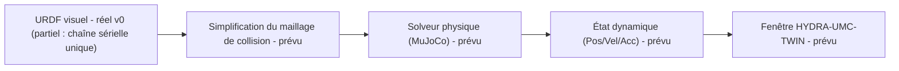

<p align="center">
  
</p>

# 🏗️ HYDRA-UMC-PHYSICS-REPLICA

<p align="center"><a href="README.md">🇺🇸 English</a> | <a href="README_spa.md">🇪🇸 Español</a> | 🇫🇷 <b>Français</b> | <a href="README_ita.md">🇮🇹 Italiano</a> | <a href="README_deu.md">🇩🇪 Deutsch</a> | <a href="README_zho.md">🇨🇳 简体中文</a> | <a href="README_jpn.md">🇯🇵 日本語</a></p>

### 📐 Simulation MuJoCo/PhysX haute fidélité des chaînes cinématiques URDF

<p align="left">
  
  
  
  
</p>

---

## 1. 🛠️ APERÇU TECHNIQUE

**HYDRA-UMC-PHYSICS-REPLICA** est le module de simulation physique central du jumeau numérique. Il se spécialise dans le calcul de bas niveau de la dynamique des corps rigides, des contraintes d'articulation et des forces de contact pour l'ensemble du catalogue de robots.

En intégrant des solveurs de pointe tels que MuJoCo ou NVIDIA PhysX, il fournit la base mathématique d'un comportement réaliste, y compris la gravité, l'inertie de la charge utile et le frottement de surface pour les tâches de Pick-and-Place.

### Caractéristiques principales :
* 📐 **Validation cinématique (v0) :** cinématique directe réelle et vérification réelle des limites d'articulation sur un sous-ensemble URDF (documenté et partiel) - voir « Vérification d'honnêteté » ci-dessous pour ce qui fonctionne exactement aujourd'hui.
* 🔒 **Réel v0 - FK avec vérification de limites :** `fk-checked` refuse de calculer une pose dans le monde pour une position d'articulation en dehors de sa limite déclarée dans l'URDF, appuyé par un vrai corpus réutilisable de limites d'articulation et des tests de régression pour les deux limites et des entrées largement hors limites - comblant l'écart où `fk` seul rapporterait silencieusement une pose physiquement inatteignable.
* 🏗️ **URDF vers Physique (v0, partiel) :** lit de vrais éléments `<joint>` (type/origine/axe/limite) d'un fichier URDF dans une chaîne. *Pas encore réel :* la génération de maillages de collision - cela reste la moitié « physique » de cette fonctionnalité.
* ⚡ **Performance en temps réel (prévu) :** résolution parallélisée pour les espaces de travail multi-robots - dépend qu'une véritable intégration de moteur physique existe d'abord.
* 🌡️ **Simulation thermique (prévu) :** prise en charge expérimentale de l'émulation de la dissipation thermique dans les têtes d'outils (T12/Laser).

**Vérification d'honnêteté - ce qui fonctionne réellement aujourd'hui :** `fk --urdf CHEMIN --joints "j1=0.5,..."` calcule de vraies positions monde par articulation en chaînant les transformations d'articulation du URDF, peu importe qu'une position soit dans sa limite déclarée ; `fk-checked` effectue le même calcul mais vérifie d'abord chaque position par rapport à la vraie vérification de `validate-limits`, refusant de calculer (ou de signaler) une quelconque pose si quelque chose est hors limites ; `validate-limits --urdf CHEMIN --joints "..."` signale de vraies articulations hors limites de son côté. Les trois sont de la cinématique pure - pas de dynamique de corps rigide, pas de forces de contact, aucun solveur MuJoCo/PhysX encore branché, et le lecteur URDF ne prend en charge qu'une seule chaîne sérielle (voir la documentation propre du module `urdf.rs` pour le pourquoi). Voir [`CHANGELOG.md`](CHANGELOG.md) pour ce qui a été livré exactement, et la Roadmap ci-dessous pour ce qui reste à venir.

---

## 2. 🔄 FLUX DE PHYSIQUE (PIPELINE)

`URDF` (analyse) et une étape réelle et autonome de cinématique
(`fk`/`validate-limits`, non montrée comme case propre ci-dessous car
elle remplace le rôle de `SOLVE` pour v0) sont réelles aujourd'hui.
`MESH`, la vraie étape `SOLVE` (un vrai solveur MuJoCo/PhysX), `DYN` et
`TWIN` restent du travail futur.



---

## 3. 🧱 ARCHITECTURE & DÉCISIONS DE CONCEPTION

* **Pourquoi cette simulation n'a pas de dossiers `hardware/`/`firmware/`/`os/`.** Logiciel pur - aucune carte propre, donc ces dossiers ont été supprimés plutôt que laissés vides.
* **Pourquoi c'est une sœur, pas un sous-module, de HYDRA-UMC-TWIN.** Le solveur physique tourne à sa propre fréquence de tick, indépendamment du rendu - le garder comme processus séparé signifie qu'un pas physique lent ne bloque pas le propre framerate de HYDRA-UMC-TWIN, et l'un ou l'autre peut être remplacé/mis à niveau (ex. MuJoCo contre PhysX) sans toucher à l'autre.
* **Comment cela s'intègre dans le reste de l'écosystème.** Alimente le propre moteur de rendu de HYDRA-UMC-TWIN avec une vraie simulation de corps rigides/contacts - la vérification de plausibilité physique derrière 'si ça marche dans le Jumeau, ça marche sur le terrain'.
* **Pourquoi v0 analyse les éléments `<joint>` dans l'ordre du document plutôt que de parcourir le vrai arbre de liaisons du URDF.** Un vrai URDF est un arbre de liaisons qui peut se ramifier à n'importe quelle articulation ; le parcourir correctement nécessite de suivre les noms de liaison `parent`/`child` de chaque articulation depuis la liaison racine. v0 traite plutôt l'ordre du document comme une chaîne sérielle unique - honnête pour le propre catalogue de `HYDRA-UMC-EDITOR-URDF`, qui est aujourd'hui surtout composé de bras sériels uniques, mais une vraie limitation pour tout ce qui se ramifie (voir `urdf.rs`).
* **Pourquoi `roxmltree` est la seule dépendance, pas encore un binding complet de moteur physique.** La cinématique directe et la vérification de limites réelles n'ont besoin de rien de plus que lire des attributs XML et faire de l'algèbre matricielle à la main (`transform.rs`) - ajouter un binding FFI MuJoCo/PhysX pour cela serait du poids de dépendance sans réel bénéfice avant qu'une vraie simulation de corps rigides/contacts ne soit en cours de construction.
* **Pourquoi `fk-checked` est une nouvelle sous-commande plutôt qu'une modification de `fk` sur place.** `fk` est l'utilitaire de bas niveau existant, mathématique pur - certains appelants (ex. ajuster une limite elle-même) veulent vraiment la pose non vérifiée pour une valeur hors limites. `fk-checked` ajoute le point d'entrée sécurisé, avec vérification de limites, que les appelants réels devraient utiliser, sans changer silencieusement ce que `fk` a toujours signifié.
* **Pourquoi le corpus de limites d'articulation (`corpus.rs`) est réservé aux tests.** Il existe uniquement pour donner aux tests de régression de `limits.rs` et `kinematics.rs` un seul ensemble de fixtures réel et partagé au lieu de littéraux ad hoc dupliqués - il n'a aucune raison d'être livré dans le binaire de release, donc il est protégé derrière `#[cfg(test)]`.

---

## 📂 STRUCTURE DES RÉPERTOIRES

Moteur de simulation purement logiciel, sans conception matérielle propre -
les dossiers de code ne sont inclus que lorsque leur implémentation les
requiert; ce projet ne comporte donc pas `hardware/`, `firmware/` ni `os/`.

```text
HYDRA-UMC-PHYSICS-REPLICA/
├── src/
│   ├── transform.rs      # Vec3/Mat4 réels (translation, rotation axe-angle, rpy)
│   ├── urdf.rs           # Lecteur URDF réel et partiel (chaîne sérielle unique)
│   ├── kinematics.rs     # forward_kinematics() réel + forward_kinematics_checked()
│   ├── limits.rs         # validate_limits() réel
│   ├── corpus.rs         # Corpus de fixtures de limites, réservé aux tests
│   └── main.rs           # Point d'entrée + sous-commandes réelles `fk`/`fk-checked`/`validate-limits`
├── docs/
│   └── CLI_REFERENCE.md # Référence complète de la ligne de commande, chaque code de sortie et cas d'erreur
├── build/               # Notes/artefacts de build (la sortie réelle de cargo vit dans target/, ignoré par git)
├── images/              # Médias et diagrammes
├── tools/
│   ├── build_test.py    # Vérification de build sans versionnage
│   └── ci_validate.py   # Validation manifeste/CHANGELOG/docs utilisée par CI
├── Cargo.toml           # Métadonnées du paquet, dépendances (roxmltree), version compteur kilométrique
├── bump_version.py      # Incrément de version native type compteur kilométrique (utilisé par build.sh/.bat)
├── bump_manifest_version.py # Synchronise la version de hydra-umc.project.json avec la version native (--sync)
├── build.sh / build.bat # Incrémente la version, `cargo test`, puis `cargo build --release`
├── build-test.sh / build-test.bat # Vérification de build sans versionnage
└── run.sh / run.bat     # Exécute le binaire release compilé (relaie les arguments)
```

---

## 🏗️ BUILD ET RUN

Nécessite la chaîne d'outils Rust (`cargo`/`rustc`, à installer via [rustup](https://rustup.rs)) et Python 3.10+ (uniquement pour `bump_version.py`).

```bash
# Linux / macOS
./build.sh   # incrément de version compteur kilométrique, `cargo test` (35 tests), puis `cargo build --release`
./run.sh     # exécute target/release/hydra-umc-physics-replica, affiche nom + version + rôle
```

```bat
:: Windows
build.bat
run.bat
```

`build.sh`/`build.bat` incrémentent la version du propre `Cargo.toml` de ce projet selon la règle "compteur kilométrique" de l'écosystème (PATCH+1, avec retenue vers MINOR au-delà de 9), exécutent la vraie suite de tests, puis construisent un binaire release.

Les vraies sous-commandes `fk` et `validate-limits` ont besoin d'un fichier URDF :

```bash
./run.sh fk --urdf arm.urdf --joints "shoulder=0,elbow=0"
# shoulder: x=0.000000 y=0.000000 z=0.200000
# elbow: x=0.300000 y=0.000000 z=0.200000

./run.sh validate-limits --urdf arm.urdf --joints "shoulder=3.0,elbow=0.2"
# LIMIT VIOLATION: joint 'shoulder' = 3.000000 (allowed [-1.570000, 1.570000])
```

La vraie sous-commande `fk-checked` refuse de calculer une pose lorsqu'une articulation est hors limites - contrairement à `fk` seul, qui la calcule quand même :

```bash
./run.sh fk-checked --urdf arm.urdf --joints "shoulder=0.5,elbow=0.2"
# shoulder: x=0.000000 y=0.000000 z=0.200000
# elbow: x=0.263275 y=0.143828 z=0.200000

./run.sh fk-checked --urdf arm.urdf --joints "shoulder=0.5,elbow=5.0"
# LIMIT VIOLATION: joint 'elbow' = 5.000000 (allowed [-2.000000, 2.000000]) - refusing to compute an unreachable pose

./run.sh fk --urdf arm.urdf --joints "shoulder=0.5,elbow=5.0"
# elbow: x=0.263275 y=0.143828 z=0.200000   <- calculé quand même ; c'est l'écart que fk-checked comble
```

`fk` se termine avec `0` en cas de succès, `2` si `--urdf`/`--joints` est invalide. `fk-checked` se termine avec `0` (vraie pose), `1` (violation de limite), ou `2` (entrée invalide). `validate-limits` se termine avec `0` (aucune violation), `1` (violations trouvées), ou `2` (entrée invalide).

Voir [`docs/CLI_REFERENCE.md`](docs/CLI_REFERENCE.md) pour la référence complète de la ligne de commande, avec chaque cas d'erreur réel (arguments manquants/malformés, un fichier URDF illisible) capturé lors d'une exécution réelle du binaire de release.

---

## 🚀 FEUILLE DE ROUTE
* **Phase 1 :** Synchronisation du jumeau numérique avec la télémétrie matérielle en temps réel et latence inférieure à 10 ms.
* **Phase 2 :** Intégration de Physics Replica avec des simulateurs de classe industrielle (Isaac Sim) et prise en charge des corps déformables.
* **Phase 3 :** Modèles de récupération automatisés de Node Healing pour un basculement décentralisé et détection précoce de la dégradation des capteurs.
* **Phase 4 :** Prise en charge de la simulation de corps déformables (câbles et tubes à vide) et génération de données synthétiques photoréalistes.

---

## 🔗 Projets Liés

Ce projet fait partie de l'écosystème robotique HYDRA-UMC du même auteur (JuanenRac / Electro Hobby 3D). Bon à savoir, car une demande pourrait en réalité concerner l'un de ceux-ci plutôt que ce dépôt.

**Projet Parent**
- **[HYDRA-UMC-TWIN](https://github.com/JuanenRac/HYDRA-UMC-TWIN)** — hub d'intégration pour le moteur de jumeau numérique, avec un vrai contrat de synchronisation par compatibilité de version ; le parent dont ce dépôt est un service de simulation spécifique, au sein de son propre moteur de jumeau numérique.

**Projets Frères** — les autres services de simulation du propre moteur de jumeau numérique de HYDRA-UMC-TWIN
- **[HYDRA-UMC-HIL-BRIDGE](https://github.com/JuanenRac/HYDRA-UMC-HIL-BRIDGE)** — vrai verrouillage de sécurité hardware-in-the-loop routant les commandes entre simulation et matériel réel.
- **[HYDRA-UMC-SYNTHETIC-DATA-GEN](https://github.com/JuanenRac/HYDRA-UMC-SYNTHETIC-DATA-GEN)** — vrai générateur procédural de scènes 2D avec export d'annotations YOLO/COCO.

**Directement Liés**
- **[HYDRA-UMC-EDITOR-URDF](https://github.com/JuanenRac/HYDRA-UMC-EDITOR-URDF)** — créateur/éditeur graphique de bureau pour URDF qui envoie les modèles terminés vers le propre catalogue de STUDIO — l'outil avec lequel sont créés les modèles URDF que ce projet lit (`fk`/`validate-limits`).

**Fait Également Partie de l'Écosystème**

*Matériel & Plateforme de Base*
- **[HYDRA-UMC](https://github.com/JuanenRac/HYDRA-UMC)** — la carte mère physique du bras robotique : hôte CM5 + coprocesseur STM32H745 double cœur, coordonnant jusqu'à 8 bras-outils via CAN-OTA/SPI-OTA.
- **[HYDRA-UMC-OS](https://github.com/JuanenRac/HYDRA-UMC-OS)** — couche produit reproductible sur Raspberry Pi OS pour le CM5 : agent en lecture seule, config/profils validés, provisionnement WiFi de premier contact.
- **[HYDRA-UMC-SDK](https://github.com/JuanenRac/HYDRA-UMC-SDK)** — le contrat JSON-Schema partagé et la barrière de sécurité contre laquelle chaque bridge valide ses commandes.

*Backend Central & Clients*
- **[HYDRA-UMC-SERVER](https://github.com/JuanenRac/HYDRA-UMC-SERVER)** — le vrai backend headless (REST/WebSocket) auquel parle réellement chaque client de contrôle.
- **[HYDRA-UMC-STUDIO](https://github.com/JuanenRac/HYDRA-UMC-STUDIO)** — tableau de bord de contrôle web avec visualisation 3D multi-robot en temps réel.
- **[HYDRA-UMC-SUITE](https://github.com/JuanenRac/HYDRA-UMC-SUITE)** — centre de commande d'essaim de bureau (PySide6) pour plusieurs serveurs à la fois, empaqueté en exécutable autonome.
- **[HYDRA-UMC-ANDROID-CONTROL](https://github.com/JuanenRac/HYDRA-UMC-ANDROID-CONTROL)** — application de contrôle Android native avec connexion biométrique et un compagnon Wear OS jumelé.
- **[HYDRA-UMC-IOS-CONTROL](https://github.com/JuanenRac/HYDRA-UMC-IOS-CONTROL)** — application de contrôle iOS/iPadOS (Flutter) avec synchronisation WebSocket en temps réel.
- **[HYDRA-UMC-DSI](https://github.com/JuanenRac/HYDRA-UMC-DSI)** — interface tactile native pour l'écran tactile DSI 7" embarqué, intégrée directement sur le CM5.
- **[HYDRA-UMC-BRIDGE-AMR](https://github.com/JuanenRac/HYDRA-UMC-BRIDGE-AMR)** — frontière de coordination pour les flottes AGV/AMR via un éditeur MQTT VDA 5050 réel.
- **[HYDRA-UMC-BRIDGE-CNC](https://github.com/JuanenRac/HYDRA-UMC-BRIDGE-CNC)** — coordinateur haut niveau pour cellules CNC avec accès réel au statut/octets de contrôle GRBL.
- **[HYDRA-UMC-BRIDGE-DROIDS](https://github.com/JuanenRac/HYDRA-UMC-BRIDGE-DROIDS)** — frontière de coordination pour droïdes à pattes/humanoïdes, avec un véritable émetteur de commandes Boston Dynamics Spot.
- **[HYDRA-UMC-BRIDGE-LASER](https://github.com/JuanenRac/HYDRA-UMC-BRIDGE-LASER)** — coordinateur de sécurité pour cellules laser lisant 3 vraies sécurités GPIO de clé/enceinte/verrouillage.
- **[HYDRA-UMC-BRIDGE-OPENPNP](https://github.com/JuanenRac/HYDRA-UMC-BRIDGE-OPENPNP)** — coordinateur haut niveau sûr pour le flux de cartes du pick-and-place OpenPnP.
- **[HYDRA-UMC-BRIDGE-PRINTER3D](https://github.com/JuanenRac/HYDRA-UMC-BRIDGE-PRINTER3D)** — frontière de coordination sûre pour imprimantes 3D Moonraker/Klipper, avec de vraies commandes de tâche contrôlées.
- **[HYDRA-UMC-BRIDGE-ROS2](https://github.com/JuanenRac/HYDRA-UMC-BRIDGE-ROS2)** — coordinateur de sécurité avec un vrai transport ROS 2 rclpy à importation paresseuse.
- **[HYDRA-UMC-BRIDGE-UAV](https://github.com/JuanenRac/HYDRA-UMC-BRIDGE-UAV)** — frontière de coordination pour UAV équipés de caméra, avec un véritable émetteur de commandes MAVLink.

*Plateforme d'Outils URTC*
- **[URTC](https://github.com/JuanenRac/URTC)** — firmware pour la carte physique Universal Robot Tool Controller, plus de 25 profils d'outil sur bus CAN.
- **[URTC-FLASHER](https://github.com/JuanenRac/URTC-FLASHER)** — outil de bureau à interface graphique pour flasher les cartes URTC, CAN-OTA plus SWD/JTAG puce complète.
- **[URTC-TESTER](https://github.com/JuanenRac/URTC-TESTER)** — outil de bureau de diagnostic CAN-bus en direct pour cartes URTC, un panneau par profil d'outil.
- **[URTC-WEB-STUDIO](https://github.com/JuanenRac/URTC-WEB-STUDIO)** — alternative basée navigateur à URTC-TESTER via la Web Serial API, sans installation locale.

*Nœud IA de Vision (Hailo-8)*
- **[HYDRA-UMC-VISION-NODE](https://github.com/JuanenRac/HYDRA-UMC-VISION-NODE)** — hub d'intégration pour le pipeline de vision Hailo-8, avec une vraie vérification de disponibilité matérielle par étape.
- **[HYDRA-UMC-DETECTION-HEF](https://github.com/JuanenRac/HYDRA-UMC-DETECTION-HEF)** — registre réel de modèles compilés avec vérification de chargement sécurisé par architecture Hailo/checksum.
- **[HYDRA-UMC-VISION-STREAMER](https://github.com/JuanenRac/HYDRA-UMC-VISION-STREAMER)** — générateur réel de pipeline GStreamer + config MediaMTX, avec une vraie frontière d'intégration HailoRT.
- **[HYDRA-UMC-VISUAL-SERVOING-API](https://github.com/JuanenRac/HYDRA-UMC-VISUAL-SERVOING-API)** — vraie loi de correction Position-Based Visual Servoing, verrouillée sur l'état de zone en amont.
- **[HYDRA-UMC-SAFETY-ZONES](https://github.com/JuanenRac/HYDRA-UMC-SAFETY-ZONES)** — vraie vérification de violation de zone et demande d'E-STOP, avec application de la fraîcheur de calibration.

*Nœud IA Cognitif (Hailo-10)*
- **[HYDRA-UMC-COGNITIVE-NODE](https://github.com/JuanenRac/HYDRA-UMC-COGNITIVE-NODE)** — hub d'intégration pour le pipeline cognitif Hailo-10 (orchestration LLM/VLA/voix).
- **[HYDRA-UMC-VLA-ENGINE](https://github.com/JuanenRac/HYDRA-UMC-VLA-ENGINE)** — vrai encodage/décodage de jetons d'action et génération de trajectoire pour un modèle Vision-Language-Action.
- **[HYDRA-UMC-VOICE-UI](https://github.com/JuanenRac/HYDRA-UMC-VOICE-UI)** — vrai front-end vocal (VAD + analyseur d'intention) avec un relais Watch borné et soumis à confirmation.
- **[HYDRA-UMC-SEMANTIC-PLANNER](https://github.com/JuanenRac/HYDRA-UMC-SEMANTIC-PLANNER)** — vraie décomposition de tâches basée sur des règles et récupération sémantique d'erreurs sur les codes d'erreur MCU.
- **[HYDRA-UMC-DOCS-QA](https://github.com/JuanenRac/HYDRA-UMC-DOCS-QA)** — vraie recherche documentaire TF-IDF (bibliothèque standard uniquement) sur les propres documents Markdown de cet écosystème.

*Orchestration & Essaim*
- **[HYDRA-UMC-ORCHESTRATOR](https://github.com/JuanenRac/HYDRA-UMC-ORCHESTRATOR)** — hub d'intégration avec un vrai contrat de rapport de santé gRPC/Protobuf et une machine à états de mission.
- **[HYDRA-UMC-JOB-DISPATCHER](https://github.com/JuanenRac/HYDRA-UMC-JOB-DISPATCHER)** — vraie file de tâches basée sur la priorité avec déduplication, via une vraie API HTTP.
- **[HYDRA-UMC-NODE-HEALING](https://github.com/JuanenRac/HYDRA-UMC-NODE-HEALING)** — vrai chien de garde de santé de flotte basé sur gRPC, avec retry/backoff et détection d'incohérence d'identité.
- **[HYDRA-UMC-PATH-PLANNER-3D](https://github.com/JuanenRac/HYDRA-UMC-PATH-PLANNER-3D)** — vrai planificateur de trajectoire 3D basé sur RRT, avec vraie validation des collisions obstacle/espace de travail.
- **[HYDRA-UMC-SWARM-SYNC](https://github.com/JuanenRac/HYDRA-UMC-SWARM-SYNC)** — vraie synchronisation d'état CRDT LWW-Element-Map, testée par propriétés pour la convergence multi-cellule.

*Données & Analytique*
- **[HYDRA-UMC-DATALAKE](https://github.com/JuanenRac/HYDRA-UMC-DATALAKE)** — vrai magasin de séries temporelles basé sur sqlite3, avec une vraie API HTTP d'ingestion/requête.
- **[HYDRA-UMC-ANOMALY-DETECTOR](https://github.com/JuanenRac/HYDRA-UMC-ANOMALY-DETECTOR)** — vrai détecteur d'anomalies FFT + ligne de base statistique, avec surveillance de dérive.
- **[HYDRA-UMC-PRODUCTION-REPORTS](https://github.com/JuanenRac/HYDRA-UMC-PRODUCTION-REPORTS)** — vrai calcul OEE/disponibilité sur l'historique de DATALAKE, avec export CSV reproductible.
- **[HYDRA-UMC-TELEMETRY-COLLECTOR](https://github.com/JuanenRac/HYDRA-UMC-TELEMETRY-COLLECTOR)** — vrai pipeline d'ingestion CAN/WebSocket vers DATALAKE, avec déduplication par séquence.

*Passerelle Industrielle*
- **[HYDRA-UMC-GATEWAY-INDUSTRIAL](https://github.com/JuanenRac/HYDRA-UMC-GATEWAY-INDUSTRIAL)** — hub d'intégration relayant vers les protocoles industriels, avec une vraie couche de liste blanche de commandes/contre-pression.
- **[HYDRA-UMC-OPCUA-SERVER](https://github.com/JuanenRac/HYDRA-UMC-OPCUA-SERVER)** — vrai espace d'adressage OPC-UA, vérifié avec une vraie session client du protocole binaire.
- **[HYDRA-UMC-MQTT-BROKER](https://github.com/JuanenRac/HYDRA-UMC-MQTT-BROKER)** — vrai broker MQTT avec authentification par client optionnelle et ACL de sujets.
- **[HYDRA-UMC-MTCONNECT-ADAPTER](https://github.com/JuanenRac/HYDRA-UMC-MTCONNECT-ADAPTER)** — vrais points de terminaison XML MTConnect `/probe` et `/current`, avec sortie en mode dégradé.

*Outils Complémentaires & Opérations de l'Écosystème*
- **[HYDRA-UMC-DASHBOARD-AI](https://github.com/JuanenRac/HYDRA-UMC-DASHBOARD-AI)** — panneaux Smart Summaries et Anomaly Highlighting sur DATALAKE/ANOMALY-DETECTOR, avec un repli statistique honnête.
- **[HYDRA-UMC-TOOL-CLI](https://github.com/JuanenRac/HYDRA-UMC-TOOL-CLI)** — CLI de flotte avec un vrai contrat de codes de sortie stable, un vrai client en direct de la propre API de HYDRA-UMC-SERVER.
- **[HYDRA-UMC-WATCH](https://github.com/JuanenRac/HYDRA-UMC-WATCH)** — application compagnon WearOS avec de vraies alertes haptiques et un relais vocal vers le téléphone jumelé.
- **[URTC-SMART-RACK](https://github.com/JuanenRac/URTC-SMART-RACK)** — firmware pour un rack de montage de cartes avec décodage réel d'ID d'outil et logique de préchauffage Smart Idle.
- **[URTC-VISION-TOOL](https://github.com/JuanenRac/URTC-VISION-TOOL)** — firmware plus un vrai compagnon de vision Python pour une tête d'outil d'inspection thermique/RGB.
- **[HYDRA-UMC-UPDATER](https://github.com/JuanenRac/HYDRA-UMC-UPDATER)** — outil administratif de bureau qui découvre, clone et met à jour chaque dépôt de cet écosystème.
- **[HYDRA-UMC-OS-REBUILDER](https://github.com/JuanenRac/HYDRA-UMC-OS-REBUILDER)** — outil de bureau Windows/Linux qui construit une image de la CM5 prête à graver, préchargée avec les versions les plus actuelles de l'écosystème, avec une configuration de premier démarrage Wi-Fi/utilisateur/SSH façon Raspberry Pi Imager.


---

## 📚 Documentation & Communauté

- **[CONTRIBUTING.md](CONTRIBUTING.md)** — pile technologique et lignes directrices de codage pour une pull request.
- **[CODE_OF_CONDUCT.md](CODE_OF_CONDUCT.md)** — les normes de comportement attendues dans cette communauté.
- **[SECURITY.md](SECURITY.md)** — comment signaler une vulnérabilité, et les véritables axes de sécurité de ce projet.
- **[SUPPORT.md](SUPPORT.md)** — où poser des questions et signaler des bugs.
- **[LICENSE.md](LICENSE.md)** — la licence propre de ce projet.

## 👤 AUTEUR
**JuanenRac** (Electro Hobby 3D)
📧 electrohobby3d@gmail.com
📺 [youtube.com/@electrohobby3d](https://youtube.com/@electrohobby3d)

## 📜 LICENCE
GPL-3.0 - Voir le fichier LICENSE pour plus de détails.
