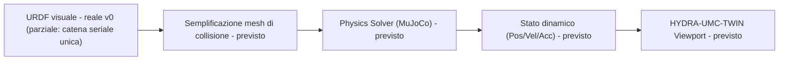

<p align="center">
  
</p>

# 🏗️ HYDRA-UMC-PHYSICS-REPLICA

<p align="center"><a href="README.md">🇺🇸 English</a> | <a href="README_spa.md">🇪🇸 Español</a> | <a href="README_fra.md">🇫🇷 Français</a> | 🇮🇹 <b>Italiano</b> | <a href="README_deu.md">🇩🇪 Deutsch</a> | <a href="README_zho.md">🇨🇳 简体中文</a> | <a href="README_jpn.md">🇯🇵 日本語</a></p>

### 📐 Simulazione MuJoCo/PhysX ad alta fedeltà di catene cinematiche URDF

<p align="left">
  
  
  
  
</p>

---

## 1. 🛠️ PANORAMICA TECNICA

**HYDRA-UMC-PHYSICS-REPLICA** è il modulo di simulazione fisica principale del Digital Twin. È specializzato nel calcolo a basso livello della dinamica dei corpi rigidi, dei vincoli dei giunti e delle forze di contatto per l'intero catalogo di robot.

Integrando solutori all'avanguardia come MuJoCo o NVIDIA PhysX, fornisce le basi matematiche per un comportamento realistico, inclusi gravità, inerzia del carico utile e attrito superficiale per i compiti di Pick-and-Place.

### Caratteristiche principali:
* 📐 **Validazione cinematica (v0):** cinematica diretta reale e verifica reale dei limiti dei giunti su un sottoinsieme URDF (documentato e parziale) - vedi "Verifica di onestà" sotto per cosa funziona esattamente oggi.
* 🔒 **Reale v0 - FK con verifica dei limiti:** `fk-checked` si rifiuta di calcolare una posa nel mondo per una posizione di giunto fuori dal suo limite dichiarato nel URDF, supportato da un vero corpus riutilizzabile di limiti dei giunti e test di regressione per entrambi i confini e input largamente fuori intervallo - chiudendo il divario in cui `fk` da solo riporterebbe silenziosamente una posa fisicamente irraggiungibile.
* 🏗️ **Da URDF a fisica (v0, parziale):** legge veri elementi `<joint>` (tipo/origine/asse/limite) da un file URDF in una catena. *Non ancora reale:* la generazione di mesh di collisione - quella resta la metà "fisica" di questa funzionalità.
* ⚡ **Prestazioni in tempo reale (previsto):** risoluzione parallelizzata per spazi di lavoro multi-robot - dipende dall'esistenza preventiva di una vera integrazione di motore fisico.
* 🌡️ **Simulazione termica (previsto):** supporto sperimentale per l'emulazione della dissipazione del calore nelle testine degli strumenti (T12/Laser).

**Verifica di onestà - cosa funziona davvero oggi:** `fk --urdf PERCORSO --joints "j1=0.5,..."` calcola vere posizioni nel mondo per ogni giunto concatenando le trasformazioni dei giunti del URDF, indipendentemente dal fatto che una posizione sia nel proprio limite dichiarato; `fk-checked` esegue lo stesso calcolo ma verifica prima ogni posizione contro la vera verifica di `validate-limits`, rifiutandosi di calcolare (o riportare) qualsiasi posa se qualcosa è fuori intervallo; `validate-limits --urdf PERCORSO --joints "..."` segnala veri giunti fuori intervallo per conto proprio. Tutti e tre sono cinematica pura - nessuna dinamica di corpo rigido, nessuna forza di contatto, nessun solutore MuJoCo/PhysX ancora collegato, e il lettore URDF supporta solo una singola catena seriale (vedi la documentazione propria del modulo `urdf.rs` per il perché). Vedi [`CHANGELOG.md`](CHANGELOG.md) per ciò che è stato consegnato esattamente, e la Roadmap sotto per ciò che resta da fare.

---

## 2. 🔄 PIPELINE FISICA

`URDF` (parsing) e un vero passo autonomo di cinematica
(`fk`/`validate-limits`, non mostrato come casella propria sotto poiché
sostituisce il ruolo di `SOLVE` per v0) sono reali oggi. `MESH`, il vero
passo `SOLVE` (un vero solutore MuJoCo/PhysX), `DYN` e `TWIN` restano
lavoro futuro.



---

## 3. 🧱 ARCHITETTURA E DECISIONI DI PROGETTAZIONE

* **Perché questa simulazione non ha cartelle `hardware/`/`firmware/`/`os/`.** Software puro - nessuna scheda propria, quindi quelle cartelle sono state rimosse invece di lasciarle vuote.
* **Perché è sorella, non un sottomodulo, di HYDRA-UMC-TWIN.** Il risolutore fisico gira alla propria frequenza di tick, indipendente dal rendering - tenerlo come processo separato significa che un passo fisico lento non blocca il framerate proprio di HYDRA-UMC-TWIN, ed entrambi possono essere sostituiti/aggiornati (es. MuJoCo contro PhysX) senza toccare l'altro.
* **Come si inserisce nel resto dell'ecosistema.** Alimenta il motore di rendering proprio di HYDRA-UMC-TWIN con una vera simulazione di corpi rigidi/contatti - il controllo di plausibilità fisica dietro 'se funziona nel Gemello, funziona in officina'.
* **Perché v0 analizza gli elementi `<joint>` nell'ordine del documento invece di percorrere il vero albero dei link del URDF.** Un vero URDF è un albero di link che può ramificarsi a qualsiasi giunto; percorrerlo correttamente richiede di seguire i nomi dei link `parent`/`child` di ogni giunto a partire dal link radice. v0 tratta invece l'ordine del documento come una singola catena seriale - onesto per il proprio catalogo di `HYDRA-UMC-EDITOR-URDF`, che oggi è per lo più composto da bracci seriali singoli, ma una vera limitazione per qualsiasi cosa si ramifichi (vedi `urdf.rs`).
* **Perché `roxmltree` è l'unica dipendenza, non ancora un binding completo di motore fisico.** La cinematica diretta reale e la verifica dei limiti reali non richiedono nient'altro che leggere attributi XML e fare algebra matriciale a mano (`transform.rs`) - aggiungere un binding FFI MuJoCo/PhysX per questo sarebbe peso di dipendenza senza reale beneficio finché non si costruisce una vera simulazione di corpi rigidi/contatti.
* **Perché `fk-checked` è un nuovo sottocomando invece di modificare `fk` sul posto.** `fk` è l'utility di basso livello esistente, matematica pura - alcuni chiamanti (es. regolare un limite stesso) vogliono davvero la posa non verificata per un valore fuori intervallo. `fk-checked` aggiunge il punto di ingresso a prova di errore, con verifica dei limiti, che i chiamanti reali dovrebbero usare, senza cambiare silenziosamente ciò che `fk` ha sempre significato.
* **Perché il corpus dei limiti dei giunti (`corpus.rs`) è solo per i test.** Esiste puramente per dare ai test di regressione di `limits.rs` e `kinematics.rs` un unico insieme di fixture reale e condiviso invece di letterali ad hoc duplicati - non ha motivo di essere incluso nel binario di release, quindi è protetto dietro `#[cfg(test)]`.

---

## 📂 STRUTTURA DELLE CARTELLE

Motore di simulazione puramente software, senza progettazione hardware
propria; le cartelle di codice sono incluse solo quando richieste
dall'implementazione, quindi il progetto non ha `hardware/`, `firmware/`
né `os/`.

```text
HYDRA-UMC-PHYSICS-REPLICA/
├── src/
│   ├── transform.rs      # Vec3/Mat4 reali (traslazione, rotazione asse-angolo, rpy)
│   ├── urdf.rs           # Lettore URDF reale e parziale (catena seriale unica)
│   ├── kinematics.rs     # forward_kinematics() reale + forward_kinematics_checked()
│   ├── limits.rs         # validate_limits() reale
│   ├── corpus.rs         # Corpus di fixture di limiti, solo per i test
│   └── main.rs           # Entry point + sottocomandi reali `fk`/`fk-checked`/`validate-limits`
├── docs/                # Documentazione e guide all'ottimizzazione
├── build/               # Note/artefatti di build (l'output reale di cargo vive in target/, escluso da git)
├── images/              # Media e diagrammi
├── tools/
│   ├── build_test.py    # Controllo build senza versionamento
│   └── ci_validate.py   # Validazione manifest/CHANGELOG/docs usata dalla CI
├── Cargo.toml           # Metadati del pacchetto, dipendenze (roxmltree), version contachilometri
├── bump_version.py      # Bump di version nativa tipo contachilometri (usato da build.sh/.bat)
├── bump_manifest_version.py # Sincronizza la versione di hydra-umc.project.json con quella nativa (--sync)
├── build.sh / build.bat # Bump della version, `cargo test`, poi `cargo build --release`
├── build-test.sh / build-test.bat # Controllo build senza versionamento
└── run.sh / run.bat     # Esegue il binario release compilato (inoltra gli argomenti)
```

---

## 🏗️ BUILD E RUN

Richiede il toolchain Rust (`cargo`/`rustc`, installabile via [rustup](https://rustup.rs)) e Python 3.10+ (solo per `bump_version.py`).

```bash
# Linux / macOS
./build.sh   # bump di version contachilometri, `cargo test` (35 test), poi `cargo build --release`
./run.sh     # esegue target/release/hydra-umc-physics-replica, stampa nome + version + ruolo
```

```bat
:: Windows
build.bat
run.bat
```

`build.sh`/`build.bat` incrementano la version del proprio `Cargo.toml` di questo progetto seguendo la regola "contachilometri" dell'ecosistema (PATCH+1, con riporto a MINOR superato 9), eseguono la vera suite di test, e poi costruiscono un binario release.

I veri sottocomandi `fk` e `validate-limits` necessitano di un file URDF:

```bash
./run.sh fk --urdf arm.urdf --joints "shoulder=0,elbow=0"
# shoulder: x=0.000000 y=0.000000 z=0.200000
# elbow: x=0.300000 y=0.000000 z=0.200000

./run.sh validate-limits --urdf arm.urdf --joints "shoulder=3.0,elbow=0.2"
# LIMIT VIOLATION: joint 'shoulder' = 3.000000 (allowed [-1.570000, 1.570000])
```

Il vero sottocomando `fk-checked` si rifiuta di calcolare una posa quando un giunto è fuori intervallo - a differenza di `fk` da solo, che la calcola comunque:

```bash
./run.sh fk-checked --urdf arm.urdf --joints "shoulder=0.5,elbow=0.2"
# shoulder: x=0.000000 y=0.000000 z=0.100000
# elbow: x=0.438791 y=0.239713 z=0.100000

./run.sh fk-checked --urdf arm.urdf --joints "shoulder=0.5,elbow=5.0"
# LIMIT VIOLATION: joint 'elbow' = 5.000000 (allowed [-2.000000, 2.000000]) - refusing to compute an unreachable pose

./run.sh fk --urdf arm.urdf --joints "shoulder=0.5,elbow=5.0"
# elbow: x=0.438791 y=0.239713 z=0.100000   <- calcolato comunque; questo è il divario che fk-checked chiude
```

`fk` esce con `0` in caso di successo, `2` se `--urdf`/`--joints` non è valido. `fk-checked` esce con `0` (posa reale), `1` (violazione di limite), o `2` (input non valido). `validate-limits` esce con `0` (nessuna violazione), `1` (violazioni trovate), o `2` (input non valido).

---

## 🚀 TABELLA DI MARCIA
* **Fase 1:** Sincronizzazione del Digital Twin con telemetria hardware in tempo real e latenza inferiore a 10 ms.
* **Fase 2:** Integrazione di Physics Replica con simulatori di livello industriale (Isaac Sim) e supporto per corpi deformabili.
* **Fase 3:** Modelli di ripristino automatizzati di Node Healing per failover decentralizzato e rilevamento precoce del degrado dei sensori.
* **Fase 4:** Supporto per la simulazione di corpi deformabili (cavi e tubi a vuoto) e generazione di dati sintetici fotorealistici.

---

## 🔗 Progetti Correlati

Questo progetto fa parte di un ecosistema robotico più ampio dello stesso autore (JuanenRac / Electro Hobby 3D), che copre firmware, software di controllo, nodi IA e strumenti di flotta. Utile saperlo, perché una richiesta potrebbe in realtà riguardare uno di questi progetti anziché questo repository.

### Famiglia

**Genitore:** **[HYDRA-UMC-TWIN](https://github.com/JuanenRac/HYDRA-UMC-TWIN)** — il genitore di integrazione alimentato da questa simulazione.

**Fratelli:**
- **[HYDRA-UMC-HIL-BRIDGE](https://github.com/JuanenRac/HYDRA-UMC-HIL-BRIDGE)** — servizio di simulazione fratello, stesso genitore.
- **[HYDRA-UMC-SYNTHETIC-DATA-GEN](https://github.com/JuanenRac/HYDRA-UMC-SYNTHETIC-DATA-GEN)** — servizio di simulazione fratello, stesso genitore.

### Relazione Diretta (fuori dalla famiglia)

- **[HYDRA-UMC-EDITOR-URDF](https://github.com/JuanenRac/HYDRA-UMC-EDITOR-URDF)** — consuma i modelli URDF creati qui.

### Resto dell'Ecosistema

**Piattaforma HYDRA-UMC** — la cella di micro-fabbrica multi-robot
- **[HYDRA-UMC](https://github.com/JuanenRac/HYDRA-UMC)** — la scheda madre CM5 + STM32H745 che orchestra fino a 8 bracci robotici.
- **[HYDRA-UMC-SERVER](https://github.com/JuanenRac/HYDRA-UMC-SERVER)** — il backend Express/WebSocket con cui parla ogni client di controllo.
- **[HYDRA-UMC-STUDIO](https://github.com/JuanenRac/HYDRA-UMC-STUDIO)** — dashboard di controllo web, visualizzazione 3D multi-robot.
- **[HYDRA-UMC-ANDROID-CONTROL](https://github.com/JuanenRac/HYDRA-UMC-ANDROID-CONTROL)** — app di controllo Android via Wi-Fi/Bluetooth.
- **[HYDRA-UMC-IOS-CONTROL](https://github.com/JuanenRac/HYDRA-UMC-IOS-CONTROL)** — app di controllo iOS/iPadOS costruita in Flutter.
- **[HYDRA-UMC-SUITE](https://github.com/JuanenRac/HYDRA-UMC-SUITE)** — centro di comando sciame desktop (Python/PySide6).
- **[HYDRA-UMC-EDITOR-URDF](https://github.com/JuanenRac/HYDRA-UMC-EDITOR-URDF)** — editor desktop di modelli URDF per il catalogo robot.
- **[HYDRA-UMC-DSI](https://github.com/JuanenRac/HYDRA-UMC-DSI)** — interfaccia touch nativa per lo schermo DSI a bordo.

**Piattaforma URTC** — il controller della testa utensile che ogni braccio HYDRA-UMC porta con sé
- **[URTC](https://github.com/JuanenRac/URTC)** — controller testa utensile su bus CAN, 25 profili utensile.
- **[URTC-FLASHER](https://github.com/JuanenRac/URTC-FLASHER)** — strumento desktop di flashing CAN-OTA + SWD/JTAG.
- **[URTC-TESTER](https://github.com/JuanenRac/URTC-TESTER)** — strumento desktop di diagnostica CAN live.
- **[URTC-WEB-STUDIO](https://github.com/JuanenRac/URTC-WEB-STUDIO)** — alternativa basata su browser via Web Serial API.

**🎥 Nodo di Visione IA (Hailo-8)**
- [HYDRA-UMC-VISION-NODE](https://github.com/JuanenRac/HYDRA-UMC-VISION-NODE)
- [HYDRA-UMC-VISION-STREAMER](https://github.com/JuanenRac/HYDRA-UMC-VISION-STREAMER)
- [HYDRA-UMC-DETECTION-HEF](https://github.com/JuanenRac/HYDRA-UMC-DETECTION-HEF)
- [HYDRA-UMC-SAFETY-ZONES](https://github.com/JuanenRac/HYDRA-UMC-SAFETY-ZONES)
- [HYDRA-UMC-VISUAL-SERVOING-API](https://github.com/JuanenRac/HYDRA-UMC-VISUAL-SERVOING-API)

**🧠 Nodo IA Cognitiva (Hailo-10)**
- [HYDRA-UMC-COGNITIVE-NODE](https://github.com/JuanenRac/HYDRA-UMC-COGNITIVE-NODE)
- [HYDRA-UMC-VLA-ENGINE](https://github.com/JuanenRac/HYDRA-UMC-VLA-ENGINE)
- [HYDRA-UMC-VOICE-UI](https://github.com/JuanenRac/HYDRA-UMC-VOICE-UI)
- [HYDRA-UMC-SEMANTIC-PLANNER](https://github.com/JuanenRac/HYDRA-UMC-SEMANTIC-PLANNER)
- [HYDRA-UMC-DOCS-QA](https://github.com/JuanenRac/HYDRA-UMC-DOCS-QA)

**🐝 Orchestrazione e Sciame**
- [HYDRA-UMC-ORCHESTRATOR](https://github.com/JuanenRac/HYDRA-UMC-ORCHESTRATOR)
- [HYDRA-UMC-SWARM-SYNC](https://github.com/JuanenRac/HYDRA-UMC-SWARM-SYNC)
- [HYDRA-UMC-PATH-PLANNER-3D](https://github.com/JuanenRac/HYDRA-UMC-PATH-PLANNER-3D)
- [HYDRA-UMC-JOB-DISPATCHER](https://github.com/JuanenRac/HYDRA-UMC-JOB-DISPATCHER)
- [HYDRA-UMC-NODE-HEALING](https://github.com/JuanenRac/HYDRA-UMC-NODE-HEALING)

**📊 Dati e Analisi**
- [HYDRA-UMC-DATALAKE](https://github.com/JuanenRac/HYDRA-UMC-DATALAKE)
- [HYDRA-UMC-TELEMETRY-COLLECTOR](https://github.com/JuanenRac/HYDRA-UMC-TELEMETRY-COLLECTOR)
- [HYDRA-UMC-ANOMALY-DETECTOR](https://github.com/JuanenRac/HYDRA-UMC-ANOMALY-DETECTOR)
- [HYDRA-UMC-PRODUCTION-REPORTS](https://github.com/JuanenRac/HYDRA-UMC-PRODUCTION-REPORTS)

**🏭 Gateway Industriale**
- [HYDRA-UMC-GATEWAY-INDUSTRIAL](https://github.com/JuanenRac/HYDRA-UMC-GATEWAY-INDUSTRIAL)
- [HYDRA-UMC-OPCUA-SERVER](https://github.com/JuanenRac/HYDRA-UMC-OPCUA-SERVER)
- [HYDRA-UMC-MQTT-BROKER](https://github.com/JuanenRac/HYDRA-UMC-MQTT-BROKER)
- [HYDRA-UMC-MTCONNECT-ADAPTER](https://github.com/JuanenRac/HYDRA-UMC-MTCONNECT-ADAPTER)

**🛠️ Strumenti Complementari**
- [URTC-SMART-RACK](https://github.com/JuanenRac/URTC-SMART-RACK)
- [URTC-VISION-TOOL](https://github.com/JuanenRac/URTC-VISION-TOOL)
- [HYDRA-UMC-WATCH](https://github.com/JuanenRac/HYDRA-UMC-WATCH)
- [HYDRA-UMC-TOOL-CLI](https://github.com/JuanenRac/HYDRA-UMC-TOOL-CLI)
- [HYDRA-UMC-DASHBOARD-AI](https://github.com/JuanenRac/HYDRA-UMC-DASHBOARD-AI)


## 👤 AUTORE
**JuanenRac** (Electro Hobby 3D)
📧 electrohobby3d@gmail.com
📺 [youtube.com/@electrohobby3d](https://youtube.com/@electrohobby3d)

## 📜 LICENZA
GPL-3.0 - Vedere LICENSE per i dettagli.
