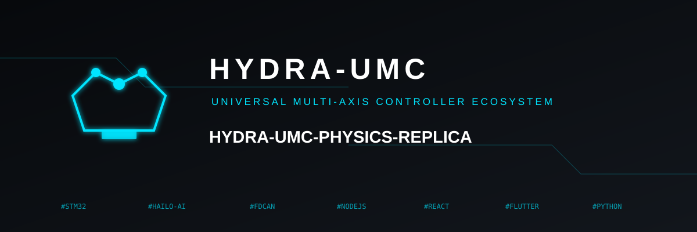
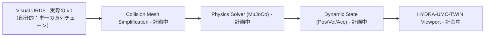

<p align="center">
  
</p>

# 🏗️ HYDRA-UMC-PHYSICS-REPLICA

<p align="center"><a href="README.md">🇺🇸 English</a> | <a href="README_spa.md">🇪🇸 Español</a> | <a href="README_fra.md">🇫🇷 Français</a> | <a href="README_ita.md">🇮🇹 Italiano</a> | <a href="README_deu.md">🇩🇪 Deutsch</a> | <a href="README_zho.md">🇨🇳 简体中文</a> | 🇯🇵 <b>日本語</b></p>

### 📐 URDF 運動学チェーンの高忠実度 MuJoCo/PhysX シミュレーション

<p align="left">
  
  
  
  
</p>

---

## 1. 🛠️ 技術概要

**HYDRA-UMC-PHYSICS-REPLICA** は、デジタルツインの中核となる物理
シミュレーションモジュールです。ロボットカタログ全体にわたる剛体力学、
関節拘束、接触力の低レベル計算に特化しています。

MuJoCo や NVIDIA PhysX のような最先端のソルバーを統合することで、重力、
ペイロード慣性、ピック＆プレースタスクにおける表面摩擦を含む、リアル
な挙動のための数学的基盤を提供します。

### 主な機能：
* 📐 **運動学的検証（v0）：** （文書化された部分的な）URDF サブセット上での実際の順運動学と実際の関節可動域チェック——今日実際に何が動くのかは下記「正直な現状確認」を参照してください。
* 🔒 **実装済み v0 —— 可動域を考慮した FK：** `fk-checked` は、URDF で宣言された可動域を超える関節位置に対してワールド座標のポーズを計算することを拒否します。実際の再利用可能な関節可動域コーパスと、両方の境界および大幅に範囲外の入力に対する回帰テストに裏付けられています——プレーンな `fk` が物理的に到達不能なポーズを黙って報告してしまうギャップを塞ぎます。
* 🏗️ **URDF から物理モデルへ（v0、部分的）：** URDF ファイルから実際の `<joint>` 要素（タイプ/原点/軸/可動域）を読み取ってチェーンを構築します。*まだ実際には存在しないもの：* 衝突メッシュの生成——それはこの機能の「物理」側半分として、今も未実装のままです。
* ⚡ **リアルタイム性能（計画中）：** マルチロボットワークスペース向けの並列化された求解——まず実際の物理エンジン統合が存在することが前提です。
* 🌡️ **熱シミュレーション（計画中）：** 工具ヘッド（T12/レーザー）における放熱をエミュレートする実験的サポート。

**正直な現状確認 —— 今日実際に動くもの：** `fk --urdf パス --joints "j1=0.5,..."` は、URDF の関節変換を連鎖させることで、その位置が宣言された可動域内にあるかどうかに関わらず、各関節の実際のワールド座標位置を計算します。`fk-checked` は同じ計算を行いますが、まず各位置を `validate-limits` の実際のチェックに通し、何かが範囲外であればポーズの計算（および報告）自体を拒否します。`validate-limits --urdf パス --joints "..."` は、実際に可動域を超えた関節を単独で報告します。3 つとも純粋な運動学です——剛体力学も、接触力も、MuJoCo/PhysX ソルバーの接続もまだなく、URDF リーダーは単一の直列チェーンのみをサポートします（理由は `urdf.rs` 自身のモジュールドキュメントを参照）。実際に出荷済みの内容は [`CHANGELOG.md`](CHANGELOG.md) を、まだ残っている作業は下記のロードマップを参照してください。

---

## 2. 🔄 物理パイプライン

`URDF`（パース）と、実際の独立した運動学ステップ（`fk`/
`validate-limits`。v0 では `SOLVE` の役割を代替するため、下図では
独立したボックスとして示していません）は今日すでに実際に動作します。
`MESH`、実際の `SOLVE` ステップ（本物の MuJoCo/PhysX ソルバー）、`DYN`、
`TWIN` はいずれも今後の課題のままです。



---

## 3. 🧱 アーキテクチャと設計上の決定

* **本シミュレーションに `hardware/`/`firmware/`/`os/` フォルダがない理由。** 純粋なソフトウェアであり、独自の基板を持たないため、これらのフォルダは空のまま残すのではなく意図的に省略されています。
* **HYDRA-UMC-TWIN のサブモジュールではなく兄弟プロジェクトである理由。** 物理ソルバーはレンダリングとは独立した独自のティックレートで動作します——独立したプロセスとして保つことで、遅い物理ステップが HYDRA-UMC-TWIN 自身のフレームレートを停滞させることはなく、どちらか一方を（例えば MuJoCo と PhysX の間で）入れ替え/アップグレードしても、もう一方に影響を与えません。
* **エコシステムの他の部分との関係。** HYDRA-UMC-TWIN 自身のレンダラーに実際の剛体/接触シミュレーションを供給します——これは「ツイン上で動作すれば、現場でも動作する」という理念を支える物理的妥当性の検証です。
* **v0 が実際の URDF リンクツリーを辿る代わりに、文書順で `<joint>` 要素をパースする理由。** 実際の URDF は、どの関節でも分岐しうるリンクのツリーです。これを正しく辿るには、各関節の `parent`/`child` リンク名をルートリンクから実際に辿る必要があります。v0 はその代わりに文書順を単一の直列チェーンとして扱います——今日ほとんどが単一の直列アームである `HYDRA-UMC-EDITOR-URDF` 自身のカタログに対しては正直な扱いですが、分岐するものに対しては実際の制約となります（`urdf.rs` を参照）。
* **`roxmltree` が唯一の依存関係であり、まだ完全な物理エンジンバインディングではない理由。** 実際の順運動学と実際の可動域チェックに必要なのは、XML 属性の読み取りと手書きの行列演算（`transform.rs`）だけです——実際の剛体/接触シミュレーションの構築が始まるまでは、そのために MuJoCo/PhysX の FFI バインディングを追加しても、実際の見返りのない依存関係の重みが増えるだけです。
* **`fk-checked` が `fk` をその場で変更するのではなく新しいサブコマンドである理由。** `fk` は既存の低レベルな純粋数学ユーティリティです——一部の呼び出し元（例えば可動域自体を調整する場合）は、範囲外の値に対する未チェックのポーズを実際に必要とします。`fk-checked` は、`fk` がこれまで意味してきたものを黙って変更することなく、実際の呼び出し元が使うべきフェイルセーフで可動域チェック付きのエントリポイントを追加します。
* **関節可動域コーパス（`corpus.rs`）がテスト専用である理由。** これは、`limits.rs` と `kinematics.rs` の回帰テストに、重複したその場しのぎのリテラルではなく、単一の実際の共有フィクスチャセットを与えるためだけに存在します——リリースバイナリに含める理由がないため、`#[cfg(test)]` の背後で保護されています。

---

## 📂 リポジトリ構成

純粋なソフトウェアシミュレーションエンジンで独自のハードウェア設計を
持たず、ソースフォルダは実装に必要な場合だけ含めます。そのため本プロジェクトは
`hardware/`、`firmware/`、`os/` フォルダを携えていません。

```text
HYDRA-UMC-PHYSICS-REPLICA/
├── src/
│   ├── transform.rs      # 実際の Vec3/Mat4（平行移動、軸角回転、rpy）
│   ├── urdf.rs           # 実際の、部分的な URDF リーダー（単一の直列チェーン）
│   ├── kinematics.rs     # 実際の forward_kinematics() + forward_kinematics_checked()
│   ├── limits.rs         # 実際の validate_limits()
│   ├── corpus.rs         # テスト専用の可動域フィクスチャコーパス
│   └── main.rs           # エントリポイント + 実際の `fk`/`fk-checked`/`validate-limits` サブコマンド
├── docs/
│   └── CLI_REFERENCE.md # 完全なコマンドラインリファレンス、すべての終了コードとエラーケース
├── build/               # ビルドノート/成果物（cargo 自身の出力は target/ にあり、gitignore 対象）
├── images/              # メディアと図表
├── tools/
│   ├── build_test.py    # バージョンを増やさないビルドチェック
│   └── ci_validate.py   # CI が使用するマニフェスト/CHANGELOG/ドキュメント検証
├── Cargo.toml           # パッケージメタデータ、依存関係（roxmltree）、オドメーターバージョン
├── bump_version.py      # ネイティブバージョンのオドメーター式インクリメント（build.sh/.bat が使用）
├── bump_manifest_version.py # hydra-umc.project.json のバージョンをネイティブ版と同期(--sync)
├── build.sh / build.bat # バージョンを増加させ、`cargo test`、その後 `cargo build --release` を実行
├── build-test.sh / build-test.bat # バージョンを増やさないビルドチェック
└── run.sh / run.bat     # コンパイル済みの release バイナリを実行（引数を転送）
```

---

## 🏗️ ビルドと実行

Rust ツールチェーン（`cargo`/`rustc`、[rustup](https://rustup.rs) 経由で
インストール）と Python 3.10+（`bump_version.py` のみに使用）が必要です。

```bash
# Linux / macOS
./build.sh   # オドメーター式バージョンインクリメント、`cargo test`（35 件のテスト）、その後 `cargo build --release`
./run.sh     # target/release/hydra-umc-physics-replica を実行し、名前 + バージョン + 役割を表示
```

```bat
:: Windows
build.bat
run.bat
```

`build.sh`/`build.bat` は、エコシステムの「オドメーター」規則
（PATCH+1、9 を超えると MINOR に繰り上がる）に従って本プロジェクト
自身の `Cargo.toml` のバージョンを増加させ、実際のテストスイートを
実行し、その後 release バイナリをビルドします。

実際の `fk` および `validate-limits` サブコマンドには URDF ファイルが
必要です：

```bash
./run.sh fk --urdf arm.urdf --joints "shoulder=0,elbow=0"
# shoulder: x=0.000000 y=0.000000 z=0.200000
# elbow: x=0.300000 y=0.000000 z=0.200000

./run.sh validate-limits --urdf arm.urdf --joints "shoulder=3.0,elbow=0.2"
# LIMIT VIOLATION: joint 'shoulder' = 3.000000 (allowed [-1.570000, 1.570000])
```

実際の `fk-checked` サブコマンドは、関節が範囲外の場合はポーズの計算を
拒否します——それでも計算してしまうプレーンな `fk` とは異なります：

```bash
./run.sh fk-checked --urdf arm.urdf --joints "shoulder=0.5,elbow=0.2"
# shoulder: x=0.000000 y=0.000000 z=0.200000
# elbow: x=0.263275 y=0.143828 z=0.200000

./run.sh fk-checked --urdf arm.urdf --joints "shoulder=0.5,elbow=5.0"
# LIMIT VIOLATION: joint 'elbow' = 5.000000 (allowed [-2.000000, 2.000000]) - refusing to compute an unreachable pose

./run.sh fk --urdf arm.urdf --joints "shoulder=0.5,elbow=5.0"
# elbow: x=0.263275 y=0.143828 z=0.200000   <- それでも計算されてしまう；これが fk-checked が塞ぐギャップです
```

`fk` は成功時に終了コード `0`、`--urdf`/`--joints` の値が不正な場合は
`2` で終了します。`fk-checked` は実際のポーズを返す場合は `0`、可動域
違反の場合は `1`、不正な入力の場合は `2` で終了します。`validate-limits`
は違反なしで `0`、違反ありで `1`、不正な入力で `2` を返します。

完全なコマンドラインリファレンス - 実際のリリースバイナリの実行から採取した、あらゆる実際のエラーケース（引数の欠落・不正な形式、読み取れない URDF ファイルなど）を含む - は [`docs/CLI_REFERENCE.md`](docs/CLI_REFERENCE.md) を参照してください。

---

## 🚀 ロードマップ
* **フェーズ 1：** リアルタイムハードウェアテレメトリとのデジタルツイン同期、サブ 10ms の遅延。
* **フェーズ 2：** 産業グレードのシミュレーター（Isaac Sim）との Physics Replica 統合、変形体サポート。
* **フェーズ 3：** 分散型フェイルオーバーと早期センサー劣化検知のためのノード自己修復自動化パターン。
* **フェーズ 4：** 変形体シミュレーション（ケーブルと真空チューブ）のサポートとフォトリアリスティックな合成データ生成。

---

## 🔗 関連プロジェクト

本プロジェクトは、同じ作者(JuanenRac / Electro Hobby 3D)による HYDRA-UMC ロボティクスエコシステムの一部です。リクエストが実はこの中のどれかについてのものである可能性があるため、知っておく価値があります。

**親プロジェクト**
- **[HYDRA-UMC-TWIN](https://github.com/JuanenRac/HYDRA-UMC-TWIN)** — デジタルツインエンジンの統合ハブ、実際のバージョン互換性同期契約付き。本リポジトリは、その自身のデジタルツインエンジン内における特定のシミュレーションサービスとして、この親の一部を成す。

**兄弟プロジェクト** —— HYDRA-UMC-TWIN 自身のデジタルツインエンジンにおける他のシミュレーションサービス
- **[HYDRA-UMC-HIL-BRIDGE](https://github.com/JuanenRac/HYDRA-UMC-HIL-BRIDGE)** — シミュレーションと実際のハードウェアの間でコマンドをルーティングする、実際のハードウェア・イン・ザ・ループ安全インターロック。
- **[HYDRA-UMC-SYNTHETIC-DATA-GEN](https://github.com/JuanenRac/HYDRA-UMC-SYNTHETIC-DATA-GEN)** — YOLO/COCO アノテーションのエクスポート機能を持つ、実際のプロシージャル 2D シーンジェネレーター。

**直接関連**
- **[HYDRA-UMC-EDITOR-URDF](https://github.com/JuanenRac/HYDRA-UMC-EDITOR-URDF)** — 完成したモデルを STUDIO 自身のカタログへ送信するデスクトップ用グラフィカル URDF 作成/編集ツール ——本プロジェクトが読み込む URDF モデル(`fk`/`validate-limits`)の作成に使われるツール。

**エコシステムの他のプロジェクト**

*コアハードウェア&プラットフォーム*
- **[HYDRA-UMC](https://github.com/JuanenRac/HYDRA-UMC)** — 実際のロボットアームのマザーボード——CM5 ホスト + デュアルコア STM32H745、CAN-OTA/SPI-OTA 経由で最大 8 本のツールアームを統括。
- **[HYDRA-UMC-OS](https://github.com/JuanenRac/HYDRA-UMC-OS)** — CM5 向けの再現可能な Raspberry Pi OS プロダクト層——読み取り専用エージェント、検証済み設定/プロファイル、WiFi 初回接続プロビジョニング。
- **[HYDRA-UMC-SDK](https://github.com/JuanenRac/HYDRA-UMC-SDK)** — すべてのブリッジが自身のコマンドを検証する共有 JSON-Schema 契約と安全ゲートの境界。

*コアバックエンド&クライアント*
- **[HYDRA-UMC-SERVER](https://github.com/JuanenRac/HYDRA-UMC-SERVER)** — すべての制御クライアントが実際に通信する、本物のヘッドレスバックエンド(REST/WebSocket)。
- **[HYDRA-UMC-STUDIO](https://github.com/JuanenRac/HYDRA-UMC-STUDIO)** — リアルタイムのマルチロボット 3D 可視化を備えたウェブ制御ダッシュボード。
- **[HYDRA-UMC-SUITE](https://github.com/JuanenRac/HYDRA-UMC-SUITE)** — 複数のサーバーを同時に扱えるデスクトップ(PySide6)スウォームコマンドセンター、スタンドアロン実行ファイルとしてパッケージ化。
- **[HYDRA-UMC-ANDROID-CONTROL](https://github.com/JuanenRac/HYDRA-UMC-ANDROID-CONTROL)** — 生体認証ログインとペアリングされた Wear OS コンパニオンを備えたネイティブ Android 制御アプリ。
- **[HYDRA-UMC-IOS-CONTROL](https://github.com/JuanenRac/HYDRA-UMC-IOS-CONTROL)** — リアルタイム WebSocket 同期を備えた iOS/iPadOS 制御アプリ(Flutter)。
- **[HYDRA-UMC-DSI](https://github.com/JuanenRac/HYDRA-UMC-DSI)** — 本体搭載の 7 インチ DSI タッチスクリーン向けネイティブタッチ UI、CM5 自体に組み込み。
- **[HYDRA-UMC-BRIDGE-AMR](https://github.com/JuanenRac/HYDRA-UMC-BRIDGE-AMR)** — 実際の VDA 5050 MQTT パブリッシャーによる AGV/AMR フリートの調整境界。
- **[HYDRA-UMC-BRIDGE-CNC](https://github.com/JuanenRac/HYDRA-UMC-BRIDGE-CNC)** — 実際の GRBL ステータス/制御バイトへのアクセスを持つ、CNC セルの高レベルコーディネーター。
- **[HYDRA-UMC-BRIDGE-DROIDS](https://github.com/JuanenRac/HYDRA-UMC-BRIDGE-DROIDS)** — 実際の Boston Dynamics Spot コマンド送信機能を持つ、脚型/ヒューマノイドドロイドの調整境界。
- **[HYDRA-UMC-BRIDGE-LASER](https://github.com/JuanenRac/HYDRA-UMC-BRIDGE-LASER)** — 実際のキー/筐体/インターロック GPIO セーフガード 3 系統を読み取る、レーザーセルの安全コーディネーター。
- **[HYDRA-UMC-BRIDGE-OPENPNP](https://github.com/JuanenRac/HYDRA-UMC-BRIDGE-OPENPNP)** — OpenPnP ピックアンドプレースの基板フローを安全に統括する高レベルコーディネーター。
- **[HYDRA-UMC-BRIDGE-PRINTER3D](https://github.com/JuanenRac/HYDRA-UMC-BRIDGE-PRINTER3D)** — 実際にゲート制御されたジョブコマンドを持つ、Moonraker/Klipper 3D プリンター向けの安全な調整境界。
- **[HYDRA-UMC-BRIDGE-ROS2](https://github.com/JuanenRac/HYDRA-UMC-BRIDGE-ROS2)** — 実際の遅延インポート rclpy ROS 2 トランスポートを持つ安全コーディネーター。
- **[HYDRA-UMC-BRIDGE-UAV](https://github.com/JuanenRac/HYDRA-UMC-BRIDGE-UAV)** — 実際の MAVLink コマンド送信機能を持つ、カメラ搭載 UAV の調整境界。

*URTC ツールプラットフォーム*
- **[URTC](https://github.com/JuanenRac/URTC)** — 物理的な Universal Robot Tool Controller 基板向けファームウェア、CAN バス経由の 25 以上のツールプロファイル。
- **[URTC-FLASHER](https://github.com/JuanenRac/URTC-FLASHER)** — URTC 基板用のデスクトップ GUI 書き込みツール、CAN-OTA およびフルチップ SWD/JTAG。
- **[URTC-TESTER](https://github.com/JuanenRac/URTC-TESTER)** — URTC 基板向けのデスクトップ CAN バスライブ診断ツール、ツールプロファイルごとに 1 パネル。
- **[URTC-WEB-STUDIO](https://github.com/JuanenRac/URTC-WEB-STUDIO)** — Web Serial API を使ったブラウザベースの URTC-TESTER の代替、ローカルインストール不要。

*ビジョン AI ノード(Hailo-8)*
- **[HYDRA-UMC-VISION-NODE](https://github.com/JuanenRac/HYDRA-UMC-VISION-NODE)** — Hailo-8 ビジョンパイプラインの統合ハブ、段階ごとの実際のハードウェア準備状況チェック付き。
- **[HYDRA-UMC-DETECTION-HEF](https://github.com/JuanenRac/HYDRA-UMC-DETECTION-HEF)** — Hailo アーキテクチャ/チェックサムによる安全読み込み検証を備えた、実際のコンパイル済みモデルレジストリ。
- **[HYDRA-UMC-VISION-STREAMER](https://github.com/JuanenRac/HYDRA-UMC-VISION-STREAMER)** — 実際の HailoRT 統合境界を持つ、実際の GStreamer パイプライン + MediaMTX 設定生成器。
- **[HYDRA-UMC-VISUAL-SERVOING-API](https://github.com/JuanenRac/HYDRA-UMC-VISUAL-SERVOING-API)** — 上流のゾーン状態に応じて安全ゲート制御される、実際の Position-Based Visual Servoing 補正則。
- **[HYDRA-UMC-SAFETY-ZONES](https://github.com/JuanenRac/HYDRA-UMC-SAFETY-ZONES)** — キャリブレーションの鮮度を強制する、実際のゾーン侵入チェックと E-STOP 要求。

*コグニティブ AI ノード(Hailo-10)*
- **[HYDRA-UMC-COGNITIVE-NODE](https://github.com/JuanenRac/HYDRA-UMC-COGNITIVE-NODE)** — Hailo-10 コグニティブパイプライン(LLM/VLA/音声オーケストレーション)の統合ハブ。
- **[HYDRA-UMC-VLA-ENGINE](https://github.com/JuanenRac/HYDRA-UMC-VLA-ENGINE)** — Vision-Language-Action モデル向けの、実際のアクショントークンのエンコード/デコードと軌道生成。
- **[HYDRA-UMC-VOICE-UI](https://github.com/JuanenRac/HYDRA-UMC-VOICE-UI)** — 確認ゲート付きの限定的な Watch リレーを備えた、実際の音声フロントエンド(VAD + 意図解析)。
- **[HYDRA-UMC-SEMANTIC-PLANNER](https://github.com/JuanenRac/HYDRA-UMC-SEMANTIC-PLANNER)** — MCU エラーコードに対する、実際のルールベースのタスク分解と意味的エラー復旧。
- **[HYDRA-UMC-DOCS-QA](https://github.com/JuanenRac/HYDRA-UMC-DOCS-QA)** — このエコシステム自身の Markdown ドキュメントに対する、標準ライブラリのみの実際の TF-IDF 文書検索。

*オーケストレーション&スウォーム*
- **[HYDRA-UMC-ORCHESTRATOR](https://github.com/JuanenRac/HYDRA-UMC-ORCHESTRATOR)** — 実際の gRPC/Protobuf ヘルスレポート契約とミッションステートマシンを持つ統合ハブ。
- **[HYDRA-UMC-JOB-DISPATCHER](https://github.com/JuanenRac/HYDRA-UMC-JOB-DISPATCHER)** — 実際の HTTP API 上に構築された、優先度ベースの実際のジョブキュー(重複排除付き)。
- **[HYDRA-UMC-NODE-HEALING](https://github.com/JuanenRac/HYDRA-UMC-NODE-HEALING)** — リトライ/バックオフとアイデンティティ不一致検出を備えた、実際の gRPC ベースのフリートヘルスウォッチドッグ。
- **[HYDRA-UMC-PATH-PLANNER-3D](https://github.com/JuanenRac/HYDRA-UMC-PATH-PLANNER-3D)** — 実際の障害物/ワークスペース衝突検証を備えた、実際の RRT ベースの 3D 経路プランナー。
- **[HYDRA-UMC-SWARM-SYNC](https://github.com/JuanenRac/HYDRA-UMC-SWARM-SYNC)** — 複数セルの収束についてプロパティテストされた、実際の CRDT LWW-Element-Map 状態同期。

*データ&分析*
- **[HYDRA-UMC-DATALAKE](https://github.com/JuanenRac/HYDRA-UMC-DATALAKE)** — 実際の取り込み/クエリ HTTP API を備えた、実際の sqlite3 ベースの時系列ストア。
- **[HYDRA-UMC-ANOMALY-DETECTOR](https://github.com/JuanenRac/HYDRA-UMC-ANOMALY-DETECTOR)** — ドリフト監視を備えた、実際の FFT + 統計ベースラインによる異常検知器。
- **[HYDRA-UMC-PRODUCTION-REPORTS](https://github.com/JuanenRac/HYDRA-UMC-PRODUCTION-REPORTS)** — DATALAKE の履歴に対する実際の OEE/稼働率計算、再現可能な CSV エクスポート付き。
- **[HYDRA-UMC-TELEMETRY-COLLECTOR](https://github.com/JuanenRac/HYDRA-UMC-TELEMETRY-COLLECTOR)** — シーケンス重複排除機能を備えた、DATALAKE への実際の CAN/WebSocket 取り込みパイプライン。

*産業用ゲートウェイ*
- **[HYDRA-UMC-GATEWAY-INDUSTRIAL](https://github.com/JuanenRac/HYDRA-UMC-GATEWAY-INDUSTRIAL)** — 実際のコマンド許可リスト/バックプレッシャー層を持つ、産業用プロトコルへ中継する統合ハブ。
- **[HYDRA-UMC-OPCUA-SERVER](https://github.com/JuanenRac/HYDRA-UMC-OPCUA-SERVER)** — 実際のバイナリプロトコルクライアントセッションで検証された、実際の OPC-UA アドレス空間。
- **[HYDRA-UMC-MQTT-BROKER](https://github.com/JuanenRac/HYDRA-UMC-MQTT-BROKER)** — クライアント単位のオプション認証とトピック ACL を備えた、実際の MQTT ブローカー。
- **[HYDRA-UMC-MTCONNECT-ADAPTER](https://github.com/JuanenRac/HYDRA-UMC-MTCONNECT-ADAPTER)** — 縮退モード出力を備えた、実際の MTConnect `/probe` および `/current` XML エンドポイント。

*補完ツール&エコシステム運用*
- **[HYDRA-UMC-DASHBOARD-AI](https://github.com/JuanenRac/HYDRA-UMC-DASHBOARD-AI)** — 誠実な統計フォールバックを備えた、DATALAKE/ANOMALY-DETECTOR 上のスマートサマリーと異常ハイライトパネル。
- **[HYDRA-UMC-TOOL-CLI](https://github.com/JuanenRac/HYDRA-UMC-TOOL-CLI)** — 実際の安定した終了コード契約を持つフリート CLI、HYDRA-UMC-SERVER 自身の API の本物のライブクライアント。
- **[HYDRA-UMC-WATCH](https://github.com/JuanenRac/HYDRA-UMC-WATCH)** — 実際の触覚アラートとペアリングされたスマートフォンへの音声リレーを備えた WearOS コンパニオンアプリ。
- **[URTC-SMART-RACK](https://github.com/JuanenRac/URTC-SMART-RACK)** — 実際の工具 ID デコードと Smart Idle 予熱ロジックを備えた、基板搭載ラック用ファームウェア。
- **[URTC-VISION-TOOL](https://github.com/JuanenRac/URTC-VISION-TOOL)** — サーマル/RGB 検査ツールヘッド向けの、ファームウェアと実際の Python ビジョンコンパニオン。
- **[HYDRA-UMC-UPDATER](https://github.com/JuanenRac/HYDRA-UMC-UPDATER)** — このエコシステム内のすべてのリポジトリを検出・クローン・更新する、管理用デスクトップツール。
- **[HYDRA-UMC-OS-REBUILDER](https://github.com/JuanenRac/HYDRA-UMC-OS-REBUILDER)** — エコシステムの最新バージョンをプリロードした、書き込み可能なCM5イメージを構築するWindows/Linuxデスクトップツール。Raspberry Pi Imager方式の初回起動Wi-Fi/ユーザー/SSH設定を備える。


---

## 📚 ドキュメント & コミュニティ

- **[CONTRIBUTING.md](CONTRIBUTING.md)** —— プルリクエストのための技術スタックとコーディング指針。
- **[CODE_OF_CONDUCT.md](CODE_OF_CONDUCT.md)** —— このコミュニティで期待される行動規範。
- **[SECURITY.md](SECURITY.md)** —— 脆弱性の報告方法と、このプロジェクトの実際のセキュリティ重点領域。
- **[SUPPORT.md](SUPPORT.md)** —— 質問の投稿先とバグの報告先。
- **[LICENSE.md](LICENSE.md)** —— このプロジェクト自身のライセンス。

## 👤 作者
**JuanenRac** (Electro Hobby 3D)
📧 electrohobby3d@gmail.com
📺 [youtube.com/@electrohobby3d](https://youtube.com/@electrohobby3d)

## 📜 ライセンス
GPL-3.0 —— 詳細は LICENSE を参照してください。
