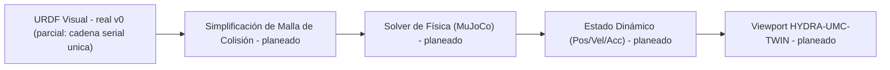

<p align="center">
  
</p>

# 🏗️ HYDRA-UMC-PHYSICS-REPLICA

<p align="center"><a href="README.md">🇺🇸 English</a> | 🇪🇸 <b>Español</b> | <a href="README_fra.md">🇫🇷 Français</a> | <a href="README_ita.md">🇮🇹 Italiano</a> | <a href="README_deu.md">🇩🇪 Deutsch</a> | <a href="README_zho.md">🇨🇳 简体中文</a> | <a href="README_jpn.md">🇯🇵 日本語</a></p>

### 📐 Simulación MuJoCo/PhysX de Alta Fidelidad de Cadenas Cinemáticas URDF

<p align="left">
  
  
  
  
</p>

---

## 1. 🛠️ VISIÓN GENERAL TÉCNICA

**HYDRA-UMC-PHYSICS-REPLICA** es el módulo de simulación física central del Digital Twin. Se especializa en el cálculo de bajo nivel de la dinámica de cuerpos rígidos, restricciones de articulaciones y fuerzas de contacto para todo el catálogo de robots.

Al integrar solvers de vanguardia como MuJoCo o NVIDIA PhysX, proporciona la base matemática para un comportamiento realista, incluyendo la gravedad, la inercia de la carga y la fricción superficial para tareas de Pick-and-Place.

### Características Clave:
* 📐 **Validación Cinemática (v0):** cinemática directa real y comprobación real de límites de articulación sobre un subconjunto de URDF (documentado y parcial) - ver "Comprobación de honestidad" abajo para lo que funciona hoy exactamente.
* 🏗️ **URDF a Física (v0, parcial):** lee elementos `<joint>` reales (tipo/origen/eje/límite) de un fichero URDF en una cadena. *Todavía no real:* la generación de mallas de colisión - esa sigue siendo la mitad "física" de esta característica.
* ⚡ **Rendimiento en Tiempo Real (planeado):** resolución paralelizada para espacios de trabajo multi-robot - depende de que exista antes una integración real de motor de física.
* 🌡️ **Simulación Térmica (planeado):** soporte experimental para emular la disipación de calor en cabezales de herramientas (T12/Láser).

**Comprobación de honestidad - qué funciona hoy de verdad:** `fk --urdf RUTA --joints "j1=0.5,..."` calcula posiciones reales en el mundo por articulación encadenando las transformaciones de las articulaciones del URDF; `validate-limits --urdf RUTA --joints "..."` reporta articulaciones reales fuera de rango. Ambas son cinemática pura - sin dinámica de cuerpo rígido, sin fuerzas de contacto, sin ningún solver MuJoCo/PhysX conectado todavía, y el lector de URDF solo soporta una cadena serial única (ver la documentación propia del módulo `urdf.rs` para el porqué). Ver [`CHANGELOG.md`](CHANGELOG.md) para lo entregado exactamente, y la Hoja de Ruta abajo para lo que sigue por delante.

---

## 2. 🔄 PIPELINE DE FÍSICA

`URDF` (parseo) y un paso real e independiente de cinemática (`fk`/
`validate-limits`, no mostrado como caja propia abajo ya que sustituye el
rol de `SOLVE` en v0) son reales hoy. `MESH`, el paso `SOLVE` real (un
solver MuJoCo/PhysX de verdad), `DYN` y `TWIN` siguen siendo trabajo
futuro.



---

## 3. 🧱 ARQUITECTURA Y DECISIONES DE DISEÑO

* **Por qué esta simulación no tiene carpetas `hardware/`/`firmware/`/`os/`.** Software puro - sin placa propia, así que esas carpetas se podaron en vez de dejarlas vacías.
* **Por qué es hermana, no un submódulo, de HYDRA-UMC-TWIN.** El solucionador de física corre a su propia frecuencia de tick, independiente del renderizado - mantenerlo como proceso separado significa que un paso de física lento no bloquea la propia tasa de fotogramas de HYDRA-UMC-TWIN, y cualquiera de los dos puede sustituirse/actualizarse (ej. MuJoCo frente a PhysX) sin tocar el otro.
* **Cómo encaja en el resto del ecosistema.** Alimenta al propio renderizador de HYDRA-UMC-TWIN con simulación real de cuerpo rígido/contactos - la comprobación de plausibilidad física detrás de 'si funciona en el Gemelo, funciona en la planta'.
* **Por qué v0 parsea elementos `<joint>` en orden de documento en vez de recorrer el árbol real de enlaces del URDF.** Un URDF real es un árbol de enlaces que puede ramificarse en cualquier articulación; recorrerlo correctamente requiere seguir los nombres de enlace `parent`/`child` de cada articulación desde el enlace raíz. v0 trata en su lugar el orden del documento como una cadena serial única - honesto para el propio catálogo de `HYDRA-UMC-EDITOR-URDF`, que hoy son mayormente brazos seriales únicos, pero una limitación real para cualquier cosa que se ramifique (ver `urdf.rs`).
* **Por qué `roxmltree` es la única dependencia, todavía no un binding completo de motor de física.** La cinemática directa y la comprobación de límites reales no necesitan nada más que leer atributos XML y hacer álgebra matricial a mano (`transform.rs`) - añadir un binding FFI de MuJoCo/PhysX para eso sería peso de dependencia sin beneficio real hasta que se esté construyendo simulación real de cuerpo rígido/contactos.

---

## 📂 ESTRUCTURA DE DIRECTORIOS

Motor de simulación puramente software, sin diseño de hardware propio - por
eso este proyecto no lleva carpetas `hardware/`, `firmware/` ni `os/` (ver
la regla de poda en `SONNET/5.PLAN_EJECUCION_32_PROYECTOS_NUEVOS.txt`).

```text
HYDRA-UMC-PHYSICS-REPLICA/
├── src/
│   ├── transform.rs      # Vec3/Mat4 reales (traslación, rotación eje-ángulo, rpy)
│   ├── urdf.rs             # Lector real y parcial de URDF (cadena serial única)
│   ├── kinematics.rs        # forward_kinematics() real
│   ├── limits.rs              # validate_limits() real
│   └── main.rs                  # Entry point + subcomandos reales `fk`/`validate-limits`
├── docs/                # Documentación y guías de optimización
├── build/               # Notas/artefactos de build (la salida real de cargo vive en target/, en .gitignore)
├── images/              # Medios y diagramas
├── scripts/             # Scripts de utilidad
├── Cargo.toml           # Metadatos del paquete, dependencias (roxmltree), version cuentakilometros
├── bump_version.py      # Bump de version tipo cuentakilometros (usado por build.sh/.bat)
├── build.sh / build.bat # Bump de version, `cargo test`, luego `cargo build --release`
└── run.sh / run.bat     # Ejecuta el binario release compilado (reenvía argumentos)
```

---

## 🏗️ BUILD Y RUN

Requiere el toolchain de Rust (`cargo`/`rustc`, instalar vía [rustup](https://rustup.rs)) y Python 3.10+ (solo para `bump_version.py`).

```bash
# Linux / macOS
./build.sh   # bump de version cuentakilometros, `cargo test` (24 tests), luego `cargo build --release`
./run.sh     # ejecuta target/release/hydra-umc-physics-replica, imprime nombre + version + rol
```

```bat
:: Windows
build.bat
run.bat
```

`build.sh`/`build.bat` incrementan la version del propio `Cargo.toml` de este proyecto siguiendo la regla "cuentakilometros" del ecosistema (PATCH+1, con acarreo a MINOR al pasar de 9), ejecutan la suite de tests real, y luego construyen un binario release.

Los subcomandos reales `fk` y `validate-limits` necesitan un fichero URDF:

```bash
./run.sh fk --urdf arm.urdf --joints "shoulder=0,elbow=0"
# shoulder: x=0.000000 y=0.000000 z=0.200000
# elbow: x=0.300000 y=0.000000 z=0.200000

./run.sh validate-limits --urdf arm.urdf --joints "shoulder=3.0,elbow=0.2"
# LIMIT VIOLATION: joint 'shoulder' = 3.000000 (allowed [-1.570000, 1.570000])
```

`fk` sale con `0` en éxito, `2` si `--urdf`/`--joints` es inválido. `validate-limits` sale con `0` (sin violaciones), `1` (violaciones encontradas), o `2` (entrada inválida).

---

## 🚀 HOJA DE RUTA
* **Fase 1:** Sincronización de Digital Twin con telemetría de hardware en tiempo real y latencia sub-10ms.
* **Fase 2:** Integración de Physics Replica con simuladores de grado industrial (Isaac Sim) y soporte para cuerpos deformables.
* **Fase 3:** Patrones de recuperación automatizados de Node Healing para failover descentralizado y detección temprana de degradación de sensores.
* **Fase 4:** Soporte para simulación de cuerpos deformables (cables y tubos de vacío) y generación de datos sintéticos fotorrealistas.

---

## 🔗 Proyectos Relacionados

Este proyecto forma parte de un ecosistema de robótica más amplio del mismo autor (JuanenRac / Electro Hobby 3D), que abarca firmware, software de control, nodos de IA y herramientas de flota. Vale la pena conocerlo, ya que una petición podría en realidad ser sobre uno de estos proyectos en vez de sobre este repositorio.

### Familia

**Padre:** **[HYDRA-UMC-TWIN](https://github.com/JuanenRac/HYDRA-UMC-TWIN)** — el padre de integración al que alimenta esta simulación.

**Hermanos:**
- **[HYDRA-UMC-HIL-BRIDGE](https://github.com/JuanenRac/HYDRA-UMC-HIL-BRIDGE)** — servicio de simulación hermano, mismo padre.
- **[HYDRA-UMC-SYNTHETIC-DATA-GEN](https://github.com/JuanenRac/HYDRA-UMC-SYNTHETIC-DATA-GEN)** — servicio de simulación hermano, mismo padre.

### Relación Directa (fuera de la familia)

- **[HYDRA-UMC-EDITOR-URDF](https://github.com/JuanenRac/HYDRA-UMC-EDITOR-URDF)** — consume los modelos URDF creados aquí.

### Resto del Ecosistema

**Plataforma HYDRA-UMC** — la célula de micro-fábrica multi-robot
- **[HYDRA-UMC](https://github.com/JuanenRac/HYDRA-UMC)** — la placa base CM5 + STM32H745 que orquesta hasta 8 brazos robóticos.
- **[HYDRA-UMC-SERVER](https://github.com/JuanenRac/HYDRA-UMC-SERVER)** — el backend Express/WebSocket con el que habla cada cliente de control.
- **[HYDRA-UMC-STUDIO](https://github.com/JuanenRac/HYDRA-UMC-STUDIO)** — panel de control web, visualización 3D multi-robot.
- **[HYDRA-UMC-ANDROID-CONTROL](https://github.com/JuanenRac/HYDRA-UMC-ANDROID-CONTROL)** — app de control Android por Wi-Fi/Bluetooth.
- **[HYDRA-UMC-IOS-CONTROL](https://github.com/JuanenRac/HYDRA-UMC-IOS-CONTROL)** — app de control iOS/iPadOS construida en Flutter.
- **[HYDRA-UMC-SUITE](https://github.com/JuanenRac/HYDRA-UMC-SUITE)** — centro de mando de enjambre de escritorio (Python/PySide6).
- **[HYDRA-UMC-EDITOR-URDF](https://github.com/JuanenRac/HYDRA-UMC-EDITOR-URDF)** — editor de modelos URDF de escritorio para el catálogo de robots.
- **[HYDRA-UMC-DSI](https://github.com/JuanenRac/HYDRA-UMC-DSI)** — interfaz táctil nativa para la pantalla DSI integrada.

**Plataforma URTC** — el controlador de cabezal de herramienta que lleva cada brazo HYDRA-UMC
- **[URTC](https://github.com/JuanenRac/URTC)** — controlador de cabezal de herramienta CAN, 25 perfiles de herramienta.
- **[URTC-FLASHER](https://github.com/JuanenRac/URTC-FLASHER)** — herramienta de escritorio de flasheo CAN-OTA + SWD/JTAG.
- **[URTC-TESTER](https://github.com/JuanenRac/URTC-TESTER)** — herramienta de escritorio de diagnóstico CAN en vivo.
- **[URTC-WEB-STUDIO](https://github.com/JuanenRac/URTC-WEB-STUDIO)** — alternativa basada en navegador vía Web Serial API.

**🎥 Vision AI Node (Hailo-8)**
- [HYDRA-UMC-VISION-NODE](https://github.com/JuanenRac/HYDRA-UMC-VISION-NODE)
- [HYDRA-UMC-VISION-STREAMER](https://github.com/JuanenRac/HYDRA-UMC-VISION-STREAMER)
- [HYDRA-UMC-DETECTION-HEF](https://github.com/JuanenRac/HYDRA-UMC-DETECTION-HEF)
- [HYDRA-UMC-SAFETY-ZONES](https://github.com/JuanenRac/HYDRA-UMC-SAFETY-ZONES)
- [HYDRA-UMC-VISUAL-SERVOING-API](https://github.com/JuanenRac/HYDRA-UMC-VISUAL-SERVOING-API)

**🧠 Cognitive AI Node (Hailo-10)**
- [HYDRA-UMC-COGNITIVE-NODE](https://github.com/JuanenRac/HYDRA-UMC-COGNITIVE-NODE)
- [HYDRA-UMC-VLA-ENGINE](https://github.com/JuanenRac/HYDRA-UMC-VLA-ENGINE)
- [HYDRA-UMC-VOICE-UI](https://github.com/JuanenRac/HYDRA-UMC-VOICE-UI)
- [HYDRA-UMC-SEMANTIC-PLANNER](https://github.com/JuanenRac/HYDRA-UMC-SEMANTIC-PLANNER)
- [HYDRA-UMC-DOCS-QA](https://github.com/JuanenRac/HYDRA-UMC-DOCS-QA)

**🐝 Orchestration & Swarm**
- [HYDRA-UMC-ORCHESTRATOR](https://github.com/JuanenRac/HYDRA-UMC-ORCHESTRATOR)
- [HYDRA-UMC-SWARM-SYNC](https://github.com/JuanenRac/HYDRA-UMC-SWARM-SYNC)
- [HYDRA-UMC-PATH-PLANNER-3D](https://github.com/JuanenRac/HYDRA-UMC-PATH-PLANNER-3D)
- [HYDRA-UMC-JOB-DISPATCHER](https://github.com/JuanenRac/HYDRA-UMC-JOB-DISPATCHER)
- [HYDRA-UMC-NODE-HEALING](https://github.com/JuanenRac/HYDRA-UMC-NODE-HEALING)

**📊 Data & Analytics**
- [HYDRA-UMC-DATALAKE](https://github.com/JuanenRac/HYDRA-UMC-DATALAKE)
- [HYDRA-UMC-TELEMETRY-COLLECTOR](https://github.com/JuanenRac/HYDRA-UMC-TELEMETRY-COLLECTOR)
- [HYDRA-UMC-ANOMALY-DETECTOR](https://github.com/JuanenRac/HYDRA-UMC-ANOMALY-DETECTOR)
- [HYDRA-UMC-PRODUCTION-REPORTS](https://github.com/JuanenRac/HYDRA-UMC-PRODUCTION-REPORTS)

**🏭 Industrial Gateway**
- [HYDRA-UMC-GATEWAY-INDUSTRIAL](https://github.com/JuanenRac/HYDRA-UMC-GATEWAY-INDUSTRIAL)
- [HYDRA-UMC-OPCUA-SERVER](https://github.com/JuanenRac/HYDRA-UMC-OPCUA-SERVER)
- [HYDRA-UMC-MQTT-BROKER](https://github.com/JuanenRac/HYDRA-UMC-MQTT-BROKER)
- [HYDRA-UMC-MTCONNECT-ADAPTER](https://github.com/JuanenRac/HYDRA-UMC-MTCONNECT-ADAPTER)

**🛠️ Complementary Tools**
- [URTC-SMART-RACK](https://github.com/JuanenRac/URTC-SMART-RACK)
- [URTC-VISION-TOOL](https://github.com/JuanenRac/URTC-VISION-TOOL)
- [HYDRA-UMC-WATCH](https://github.com/JuanenRac/HYDRA-UMC-WATCH)
- [HYDRA-UMC-TOOL-CLI](https://github.com/JuanenRac/HYDRA-UMC-TOOL-CLI)
- [HYDRA-UMC-DASHBOARD-AI](https://github.com/JuanenRac/HYDRA-UMC-DASHBOARD-AI)


## 👤 AUTOR
**JuanenRac** (Electro Hobby 3D)
📧 electrohobby3d@gmail.com

## 📜 LICENCIA
GPL-3.0 - Ver archivo LICENSE para más detalles.

## Proyectos relacionados

> Canonical public ecosystem relationship map.

**Direct integrations:**
[HYDRA-UMC-OS](https://github.com/JuanenRac/HYDRA-UMC-OS) · [HYDRA-UMC-SDK](https://github.com/JuanenRac/HYDRA-UMC-SDK) · [HYDRA-UMC-SERVER](https://github.com/JuanenRac/HYDRA-UMC-SERVER) · [URTC](https://github.com/JuanenRac/URTC) · [HYDRA-UMC-TWIN](https://github.com/JuanenRac/HYDRA-UMC-TWIN) · [HYDRA-UMC-HIL-BRIDGE](https://github.com/JuanenRac/HYDRA-UMC-HIL-BRIDGE) · [HYDRA-UMC-EDITOR-URDF](https://github.com/JuanenRac/HYDRA-UMC-EDITOR-URDF)

**Platform and contracts:**
[HYDRA-UMC-OS](https://github.com/JuanenRac/HYDRA-UMC-OS) · [HYDRA-UMC-SDK](https://github.com/JuanenRac/HYDRA-UMC-SDK)

**Rest of the ecosystem:**
All remaining public repositories are grouped by the seven ecosystem layers in the [JuanenRac ecosystem dashboard](https://juanenrac.github.io/JuanenRac/).
